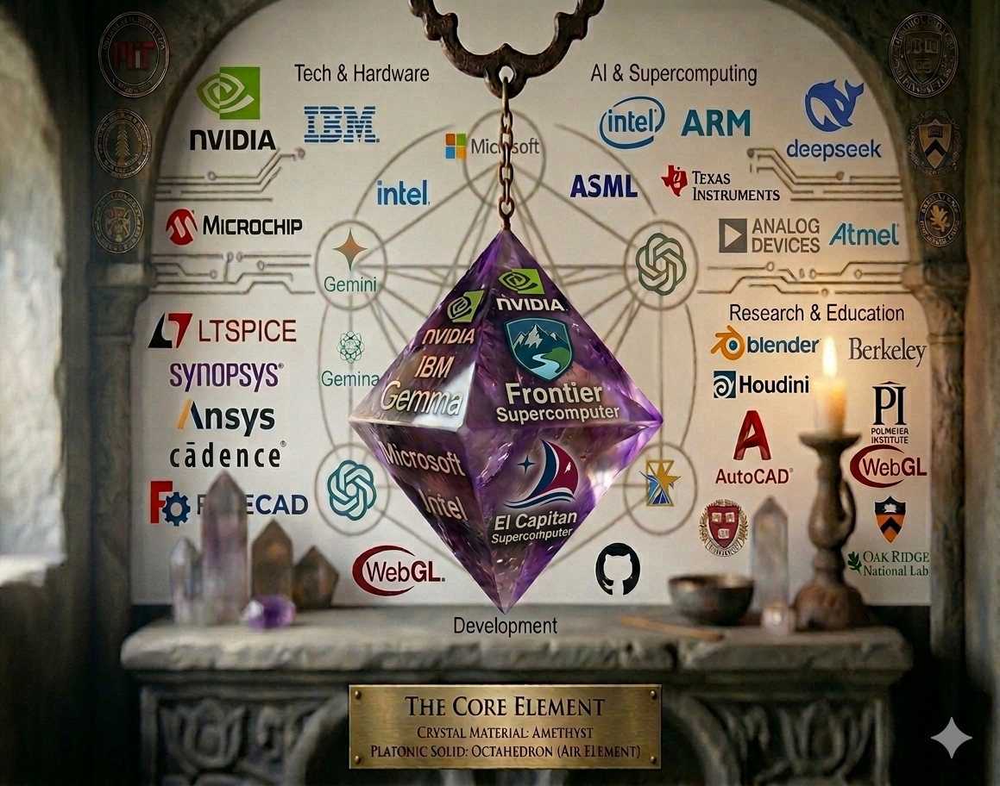
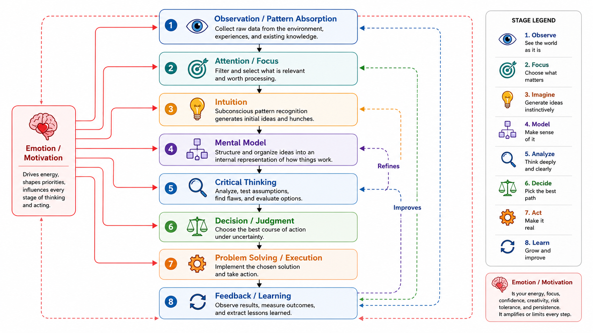
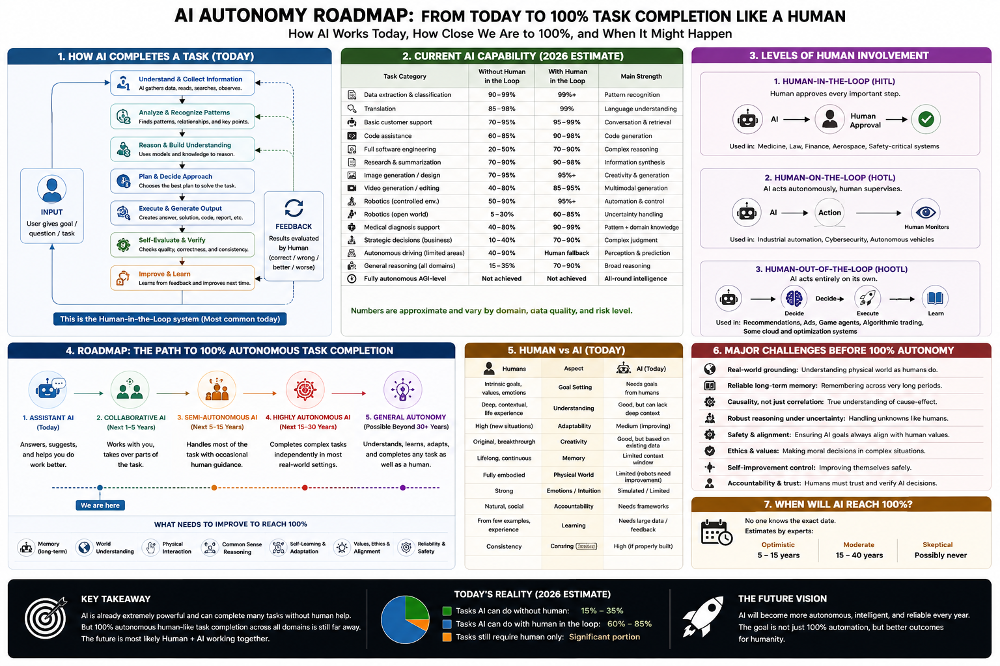

###### 📌 My Profile Pic and some images,video are generate by AI, is not true. I done this to show my ambition. My true pic in [Instagram](https://www.instagram.com/gobalkrishnan.engineer/) only. 
[](https://github.com/engineer-e/) 
[](https://github.com/engineer-work/) 
[](https://www.instagram.com/gobalkrishnan.engineer/)
[](https://engineer-work.github.io/Join-Company/)

---

[](https://youtu.be/Rezc-2nxzHM?si=9yfZNDGOa0KPKMa_)

<details>
 <summary> 🤖 AI-Driven Automation: The Future of Software Development & Labour Work with Reduced Human Involvement </summary>
<br>

| [](https://youtu.be/rbCQKODKv1o?si=sS3xqcK4E_wRcbJm) | [](https://youtu.be/vU4Ak3DBb1o?si=hRYA0fctFWVbAzc1) | [](https://youtu.be/JMLsHI8aV0g?si=6j1bHm2twbFcbCWy)| [](https://youtu.be/GK2pZ_oVU1o?si=F3OTE6wgQUltNb4e) | [](https://youtu.be/88bMVbx1dzM?si=LFnSysYTLjbT5qTK) |  [](https://youtu.be/GEozbeMEu_4?si=ifcJHJUUTC8AYspd) |
| --- | --- | --- | --- | --- | --- |
| [](https://youtu.be/xlALU-kyFdw?si=Qr5uBsbtEyAurs9k) |  [](https://youtu.be/q7Hj3J9SOXw?si=4gzlyb8F0x3N5ica) | [](https://youtu.be/x5mznemjL_o?si=HFtFpboO2RVL6KRp) | [](https://youtu.be/9RZreu5z_Gc?si=RWyQCqXRdbvz4fvo) | [](https://youtu.be/uWSB7s_DQHw?si=57566xtkhAUZ0LRA) | [](https://youtu.be/bPSLMX_V38E?si=GtC8R8McNYBNmHYu) |


# No Job to Human is current trend 🤖 AI-Driven Automation: The Future of Software Development & Labour Work with Reduced Human Involvement

# 📄 Estimated AI Impact on Software Engineering Workforce (2026–2035)

> **Note:** The following timeline is an **illustrative estimate**, not a prediction. Actual outcomes will depend on AI progress, business strategy, regulations, and economic conditions.

## 🤖 Current Evidence (2026)

Modern AI systems such as **Google Gemini, Cursor AI, GitHub Copilot, Claude, and ChatGPT** can already assist with:

* 📱 Android (Kotlin, Java)
* 🦋 Flutter (Dart)
* 🌐 Web (React, Angular, HTML, CSS, JavaScript)
* ⚙️ Backend APIs & Databases
* 🧪 Testing & Debugging
* 📄 Documentation
* 🚀 CI/CD Automation

AI is increasingly automating routine software development tasks while developers supervise and validate the results.

---

## 📅 Estimated AI Adoption Timeline

| 📅 Period     | 🚀 Expected Change                                                                |
| ------------- | --------------------------------------------------------------------------------- |
| **2026–2028** | AI automates routine coding, UI, testing, and documentation.                      |
| **2028–2031** | Smaller teams manage larger AI-generated codebases.                               |
| **2031–2035** | AI assists with architecture, cloud design, and system planning.                  |
| **2035+**     | Humans remain responsible for strategy, security, governance, and accountability. |

---

## 👨‍💻 Estimated Order of Workforce Impact

| Rank | Role                | AI Impact    |
| ---- | ------------------- | ------------ |
| 1️⃣  | Junior Developer    | 🔴 Very High |
| 2️⃣  | QA / Manual Testing | 🔴 Very High |
| 3️⃣  | DevOps              | 🟠 High      |
| 4️⃣  | Mid-level Developer | 🟠 High      |
| 5️⃣  | Software Architect  | 🟡 Medium    |
| 6️⃣  | Principal Engineer  | 🟢 Moderate  |
| 7️⃣  | CTO                 | 🔵 Lowest    |

---

## 🏢 Illustrative Team Compression

| Organization             | Today | AI-Assisted (Illustrative) |
| ------------------------ | ----: | -------------------------: |
| 🚀 Startup               |    10 |                        3–5 |
| 🏢 Enterprise Department |   100 |                      20–40 |

---

## 📈 Illustrative Example

| Year | Team Size |
| ---- | --------: |
| 2026 |        10 |
| 2028 |         7 |
| 2030 |         5 |
| 2032 |         4 |
| 2035 |         3 |

---

## 🎯 Key Message

AI is expected to **reduce routine software engineering work** and enable **smaller, more productive teams**. Rather than eliminating all technical roles, AI is shifting human responsibilities toward **review, architecture, security, governance, and strategic decision-making**. Governments, industries, and educational institutions should prepare for this transition through workforce reskilling and responsible AI adoption.

---

# 🤖 AI and the Future of Software Development

📱 I need a statement explaining that AI can create applications for **Android, Flutter, and Web**, reducing the need for large development teams in the future.

📌 **Evidence:**

* 🤖 **Google Gemini** can generate Android applications using **Kotlin**, Java, Jetpack Compose, and web applications using **React**, **Angular**, HTML, CSS, and JavaScript.
* 🦋 **Cursor AI** can assist in building **Flutter** applications, along with many other programming languages and frameworks.

💡 Because of these AI capabilities, software development is becoming increasingly automated.

🚀 In the future, startups may no longer require large development teams.

* 👥 **Startup:** A team of **10 developers** may be reduced to **2–5 developers** with AI assistance.
* 🏢 **Large MNC:** A department with **100 employees** may be reduced to around **5–20 employees**, depending on the level of AI adoption.

⏳ Over the next **5–10 years**, AI may automate many software development tasks. Even today, AI can generate applications, write code, create documentation, perform testing, and assist with deployment.

👨‍💻 In many startups and MNCs, only **3–4 people** may actively handle the majority of technical work, while the remaining work is distributed across coordination, approvals, support, maintenance, compliance, management, and other organizational responsibilities.

⚠️ Even when employees put in significant effort, recognition and credit may gradually shift to newer employees or changing organizational priorities over time.

💔 As a result, many people's careers and lives can become more difficult, including my own.

---

A single table covering **every AI tool**, **every industry**, **every repetitive task**, and **job impact** would be extremely large. For a government proposal, it's better to summarize it in one matrix.

Here is a compact version:

# 🤖 AI Platforms, Automation, and Workforce Impact (Summary)

| 🏛️ Category                    | 🤖 AI Tools / Platforms                                                                           | 🔄 Repetitive Tasks Automated                                                                                                      | 👨‍💼 Jobs Most Affected                                                                                        |
| ------------------------------- | ------------------------------------------------------------------------------------------------- | ---------------------------------------------------------------------------------------------------------------------------------- | --------------------------------------------------------------------------------------------------------------- |
| 💻 Software Development         | Google Gemini, Cursor AI, GitHub Copilot, Claude Code, ChatGPT, Windsurf, VS Code + AI, Replit AI | CRUD apps, UI screens, API generation, code completion, debugging, refactoring, testing, documentation, CI/CD, database generation | Junior Developers, QA Engineers, Web Developers, Android Developers, Flutter Developers, DevOps (routine tasks) |
| 🔬 Scientific Research          | OpenAI Deep Research, Elicit, Consensus, SciSpace, Semantic Scholar AI                            | Literature review, paper summarization, citation search, hypothesis generation, data analysis                                      | Research Assistants, Literature Review Teams, Technical Writers                                                 |
| 🧬 Biology & Drug Discovery     | AlphaFold, BioNeMo, BenchSci, Isomorphic Labs                                                     | Protein prediction, molecule screening, biomedical analysis                                                                        | Research Scientists (routine analysis), Lab Analysts                                                            |
| ⚙️ Engineering                  | Autodesk AI, Siemens AI, Cadence AI, Altium AI, Ansys AI                                          | CAD drafting, PCB layout assistance, simulation setup, optimization, report generation                                             | CAD Designers, Drafting Engineers, Simulation Engineers (routine work)                                          |
| 🏗️ Architecture & Construction | Autodesk AI, BIM AI Tools                                                                         | Floor plans, BIM modeling, quantity estimation, rendering                                                                          | Draftsmen, BIM Modelers, Junior Architects                                                                      |
| 🏥 Healthcare                   | Google Health AI, Microsoft AI, IBM watsonx                                                       | Medical image analysis, clinical documentation, report drafting                                                                    | Medical Scribes, Administrative Staff, Imaging Support                                                          |
| 💰 Finance & Banking            | IBM watsonx, Bloomberg AI, Intuit AI                                                              | Accounting, reconciliation, reporting, fraud detection, forecasting                                                                | Accountants (routine tasks), Financial Analysts (basic reporting)                                               |
| ⚖️ Legal                        | Harvey AI, Claude, ChatGPT                                                                        | Contract review, document drafting, legal research                                                                                 | Legal Assistants, Paralegals                                                                                    |
| 📊 Business Operations          | Salesforce Agentforce, Microsoft Copilot, Google Workspace AI                                     | Emails, reports, presentations, scheduling, customer support, CRM updates                                                          | Administrative Staff, Customer Support, Office Assistants                                                       |
| 🎨 Creative Media               | Adobe Firefly, Runway, Veo, Suno, Udio                                                            | Image generation, video editing, animation, music generation                                                                       | Graphic Designers (routine work), Video Editors                                                                 |
| 🚚 Manufacturing & Robotics     | NVIDIA Isaac, Siemens Industrial AI                                                               | Inspection, production monitoring, predictive maintenance                                                                          | Quality Inspectors, Production Operators                                                                        |
| 🎓 Education                    | Khanmigo, ChatGPT, Gemini                                                                         | Lesson preparation, grading assistance, quiz generation                                                                            | Teaching Assistants, Content Developers                                                                         |

---

## 🔄 Common Repetitive Tasks AI Can Automate

* 💻 Routine coding (CRUD, forms, APIs)
* 📱 UI generation
* 🐞 Bug fixing
* 🧪 Unit & integration testing
* 📄 Documentation
* 📚 Literature review
* 📊 Report generation
* 📈 Data analysis
* 📧 Email writing
* 📞 Customer support
* 📝 Data entry
* 📋 Form processing
* 🗂️ Scheduling
* 🎨 Basic graphic design
* 🎬 Basic video editing
* 📑 Contract drafting
* 🧾 Accounting entries
* 📦 Inventory tracking
* 🔍 Information search
* 📊 Dashboard creation

---

## 📉 Potential Workforce Impact (Illustrative)

| 👥 Role                    | 🤖 AI Impact |
| -------------------------- | ------------ |
| Junior Developer           | 🔴 Very High |
| QA / Manual Tester         | 🔴 Very High |
| Documentation Engineer     | 🔴 Very High |
| Technical Writer           | 🔴 Very High |
| Customer Support           | 🔴 Very High |
| Data Entry Operator        | 🔴 Very High |
| Administrative Assistant   | 🔴 Very High |
| Web Developer              | 🟠 High      |
| Android Developer          | 🟠 High      |
| Flutter Developer          | 🟠 High      |
| CAD Designer               | 🟠 High      |
| Research Assistant         | 🟠 High      |
| Accountant (Routine Work)  | 🟠 High      |
| Software Architect         | 🟡 Medium    |
| Senior Engineer            | 🟡 Medium    |
| Principal Engineer         | 🟢 Lower     |
| CTO / Executive Leadership | 🔵 Lowest    |

> **Note:** AI is expected to automate many **repetitive and routine tasks**, allowing organizations to operate with **smaller, AI-assisted teams**. This does **not** mean these professions will disappear entirely. Instead, routine implementation work is increasingly automated, while human roles shift toward **oversight, complex decision-making, security, compliance, creativity, leadership, and accountability**.

---

A polished report should separate AI tools by **domain** rather than mixing everything together. That makes it much easier for readers—including government officials—to understand.

# 🤖 AI Tools, Repetitive Tasks & Workforce Impact Report (2026)

> **Purpose:** This table summarizes major AI tools, the repetitive tasks they automate, and the job roles that may be most affected. The workforce impact column indicates **potential changes in routine work**, not guaranteed job losses.

| 🏷️ Category          | 🤖 AI Tool              | 🌐 Official Website                                                                                  | 🔄 Repetitive Tasks Automated                                | 👨‍💼 Roles Most Affected                                 |
| :-------------------- | :---------------------- | :--------------------------------------------------------------------------------------------------- | :----------------------------------------------------------- | :-------------------------------------------------------- |
| 📱 Mobile Development | Google Gemini           | [https://gemini.google.com](https://gemini.google.com)                                               | Android Apps, Kotlin, Java, Flutter, UI, APIs, Documentation | Android Developers, Flutter Developers, Junior Developers |
| 💻 AI Coding          | Gemini Code Assist      | [https://developers.google.com/gemini-code-assist](https://developers.google.com/gemini-code-assist) | Code Completion, Refactoring, Debugging, Testing             | Software Developers                                       |
| 🚀 AI IDE             | Cursor AI               | [https://cursor.com](https://cursor.com)                                                             | Flutter, Web, Android, Backend, Bug Fixing, Testing          | Flutter Developers, Web Developers                        |
| 💙 Code Editor        | VS Code + AI Extensions | [https://code.visualstudio.com](https://code.visualstudio.com)                                       | AI Coding, Refactoring, Documentation                        | Software Developers                                       |
| 🌌 AI IDE             | Trae AI                 | [https://trae.ai](https://trae.ai)                                                                   | Full-Stack Development, AI Coding                            | Software Developers                                       |
| 🐙 AI Coding          | GitHub Copilot          | [https://github.com/features/copilot](https://github.com/features/copilot)                           | Code Generation, Unit Tests, Documentation                   | Software Developers                                       |
| 🌊 AI IDE             | Windsurf                | [https://windsurf.com](https://windsurf.com)                                                         | Full-Stack Development, Automation                           | Software Developers                                       |
| ☁️ Cloud IDE          | Replit AI               | [https://replit.com/ai](https://replit.com/ai)                                                       | Cloud Apps, Deployment                                       | Full-Stack Developers                                     |
| 💬 AI Assistant       | ChatGPT                 | [https://chatgpt.com](https://chatgpt.com)                                                           | Coding, Reports, Documentation, Research, Analysis           | Developers, Researchers, Technical Writers                |
| 🧠 AI Assistant       | Claude                  | [https://claude.ai](https://claude.ai)                                                               | Long Documents, Code Review, Architecture                    | Software Engineers                                        |
| ⚡ AI Agent            | Claude Code             | [https://www.anthropic.com/claude-code](https://www.anthropic.com/claude-code)                       | Repository Automation, Bug Fixing                            | Software Engineers                                        |
| ☁️ Cloud AI           | Amazon Q Developer      | [https://aws.amazon.com/q/developer](https://aws.amazon.com/q/developer)                             | AWS, DevOps, Infrastructure Automation                       | DevOps Engineers                                          |
| 🔷 AI Coding          | Tabnine                 | [https://www.tabnine.com](https://www.tabnine.com)                                                   | Code Completion                                              | Software Developers                                       |
| 🔎 Enterprise AI      | Sourcegraph Cody        | [https://sourcegraph.com/cody](https://sourcegraph.com/cody)                                         | Large Codebase Search, AI Coding                             | Enterprise Developers                                     |
| 🔧 Open Source AI     | Continue                | [https://continue.dev](https://continue.dev)                                                         | AI Coding inside IDE                                         | Software Developers                                       |
| 💻 Terminal AI        | Aider                   | [https://aider.chat](https://aider.chat)                                                             | Git Automation, Coding                                       | Software Developers                                       |
| 🔬 AI Research        | OpenAI Deep Research    | [https://chatgpt.com](https://chatgpt.com)                                                           | Literature Review, Research Reports                          | Research Assistants                                       |
| 📚 AI Research        | Elicit                  | [https://elicit.com](https://elicit.com)                                                             | Paper Search, Evidence Review                                | Researchers                                               |
| 🔍 AI Research        | Consensus               | [https://consensus.app](https://consensus.app)                                                       | Scientific Search                                            | Researchers                                               |
| 📄 AI Research        | SciSpace                | [https://typeset.io](https://typeset.io)                                                             | Paper Reading & Summaries                                    | Students, Researchers                                     |
| 🧬 Biology AI         | AlphaFold               | [https://alphafold.ebi.ac.uk](https://alphafold.ebi.ac.uk)                                           | Protein Structure Prediction                                 | Biology Researchers                                       |
| 🧪 Scientific AI      | Microsoft Discovery     | [https://www.microsoft.com/discovery](https://www.microsoft.com/discovery)                           | Materials Discovery                                          | Materials Scientists                                      |
| ⚗️ Drug Discovery     | NVIDIA BioNeMo          | [https://www.nvidia.com/en-us/clara/bionemo/](https://www.nvidia.com/en-us/clara/bionemo/)           | Molecular Modeling                                           | Drug Researchers                                          |
| ⚖️ Legal AI           | Harvey AI               | [https://www.harvey.ai](https://www.harvey.ai)                                                       | Contract Review, Legal Research                              | Legal Assistants                                          |
| 🎨 Design AI          | Adobe Firefly           | [https://firefly.adobe.com](https://firefly.adobe.com)                                               | Image Editing, Graphic Design                                | Graphic Designers                                         |
| 🎬 Video AI           | Runway                  | [https://runwayml.com](https://runwayml.com)                                                         | Video Editing & Generation                                   | Video Editors                                             |
| 🎵 Music AI           | Suno                    | [https://suno.com](https://suno.com)                                                                 | Music Composition                                            | Music Producers                                           |

---

# 🔄 Common Repetitive Tasks Automated by AI

### 💻 Software Engineering

* ✅ CRUD Applications
* ✅ UI Development
* ✅ API Development
* ✅ Database Design
* ✅ Unit Testing
* ✅ Debugging
* ✅ Refactoring
* ✅ Documentation
* ✅ CI/CD Pipelines

### 🔬 Research

* ✅ Literature Review
* ✅ Paper Summarization
* ✅ Citation Search
* ✅ Data Analysis
* ✅ Report Writing
* ✅ Hypothesis Generation

### 🏗️ Engineering & Design

* ✅ CAD Drafting
* ✅ PCB Layout Assistance
* ✅ Simulation Setup
* ✅ Cost Estimation
* ✅ BIM Modeling

### 📊 Business

* ✅ Email Writing
* ✅ Report Generation
* ✅ Spreadsheet Analysis
* ✅ Customer Support
* ✅ HR Screening
* ✅ Meeting Summaries

### 🎨 Creative

* ✅ Image Generation
* ✅ Video Editing
* ✅ Presentation Creation
* ✅ Music Generation
* ✅ Content Writing

---

# 📉 Workforce Impact (Illustrative)

| 🔴 Very High        | 🟠 High                            | 🟡 Medium           | 🟢 Lower             |
| ------------------- | ---------------------------------- | ------------------- | -------------------- |
| Data Entry          | Android Developers (Routine Tasks) | Software Architects | CTO                  |
| Documentation       | Flutter Developers (Routine Tasks) | Senior Engineers    | Executive Leadership |
| Technical Writing   | Web Developers (Routine Tasks)     | Principal Engineers | Business Strategy    |
| Manual QA           | DevOps (Routine Tasks)             | Research Scientists | Legal Accountability |
| Customer Support    | CAD Designers                      | Project Managers    |                      |
| Research Assistants | Graphic Designers                  |                     |                      |

> **📌 Summary:** AI is rapidly automating repetitive and predictable work across software development, research, engineering, business operations, and creative industries. As AI capabilities improve, organizations may require **smaller, AI-assisted teams**, while human work increasingly focuses on **decision-making, innovation, leadership, security, ethics, and accountability**.

---

Here is a **6-column table** with official learning resources (and YouTube where available) that you can include in your report.

| 📂 Category      | 🤖 AI Tool           | 🎯 Learn                     | 🎥 Video / Tutorial                                                                                           | 🌐 Official Website                                                                           | 🔄 Repetitive Tasks Automated                                                     |
| ---------------- | -------------------- | ---------------------------- | ------------------------------------------------------------------------------------------------------------- | --------------------------------------------------------------------------------------------- | --------------------------------------------------------------------------------- |
| 💻 AI Coding     | Google Gemini        | Android, Web, AI Coding      | [Gemini YouTube Videos](https://www.reddit.com/r/ChatGPTPromptGenius/comments/18cibyx?utm_source=chatgpt.com) | [Google Gemini](https://gemini.google.com?utm_source=chatgpt.com)                             | Android Apps, Web Apps, Code Generation, Documentation, Testing                   |
| 💻 AI Coding     | Gemini Code Assist   | VS Code, Android Studio      | [Google AI Learning Courses](https://ai.google/learn-ai-skills/?utm_source=chatgpt.com)                       | [Gemini Code Assist](https://developers.google.com/gemini-code-assist?utm_source=chatgpt.com) | Code Completion, Debugging, Refactoring                                           |
| 🚀 AI IDE        | Cursor AI            | AI Software Development      | [Cursor YouTube Channel](https://www.youtube.com/@cursor_ai?utm_source=chatgpt.com)                           | [Cursor AI](https://cursor.com?utm_source=chatgpt.com)                                        | Flutter, React, APIs, Testing, Bug Fixing                                         |
| 🌊 AI IDE        | Windsurf             | AI IDE                       | [Windsurf YouTube Channel](https://www.youtube.com/@windsurf_ai?utm_source=chatgpt.com)                       | [Windsurf](https://windsurf.com?utm_source=chatgpt.com)                                       | Full-Stack Development, Automation                                                |
| 🐙 AI Coding     | GitHub Copilot       | AI Pair Programming          | [GitHub Copilot Docs & Videos](https://docs.github.com/copilot?utm_source=chatgpt.com)                        | [GitHub Copilot](https://github.com/features/copilot?utm_source=chatgpt.com)                  | Code Completion, Unit Tests, Documentation                                        |
| 💬 AI Assistant  | ChatGPT              | Programming & Research       | [OpenAI Academy](https://academy.openai.com?utm_source=chatgpt.com)                                           | [ChatGPT](https://chatgpt.com?utm_source=chatgpt.com)                                         | Coding, Documentation, Reports, Research                                          |
| 🧠 AI Assistant  | Claude               | Software Engineering         | [Claude YouTube Channel](https://www.youtube.com/@AnthropicAI?utm_source=chatgpt.com)                         | [Claude](https://claude.ai?utm_source=chatgpt.com)                                            | Code Review, Documentation, Architecture                                          |
| ⚡ AI Agent       | Claude Code          | AI Coding Agent              | [Claude Code Docs](https://docs.anthropic.com?utm_source=chatgpt.com)                                         | [Claude Code](https://www.anthropic.com/claude-code?utm_source=chatgpt.com)                   | Repository Automation, Refactoring                                                |
| 🔬 AI Research   | OpenAI Deep Research | AI Research                  | [OpenAI Academy](https://academy.openai.com?utm_source=chatgpt.com)                                           | [OpenAI](https://openai.com?utm_source=chatgpt.com)                                           | Literature Review, Research Reports                                               |
| 🧬 Scientific AI | AlphaFold            | Protein Structure Prediction | [AlphaFold Documentation](https://alphafold.ebi.ac.uk?utm_source=chatgpt.com)                                 | [AlphaFold](https://alphafold.ebi.ac.uk?utm_source=chatgpt.com)                               | Protein Analysis, Drug Research                                                   |
| 🤖 Robotics AI   | Gemini Robotics      | Robotics & Embodied AI       | [Inside Gemini Robotics Video](https://blog.google/feed/gemini-robotics-video/?utm_source=chatgpt.com)        | [Gemini Robotics](https://deepmind.google/models/gemini-robotics/?utm_source=chatgpt.com)     | Robot Training, Human Demonstration Learning, Manipulation ([Google DeepMind][1]) |

This table covers:

* 💻 AI Coding
* 📱 Android Development
* 🦋 Flutter Development
* 🌐 Web Development
* 🔬 Research AI
* 🤖 Robotics AI

and highlights the **repetitive tasks** each tool can help automate or accelerate.

[1]: https://deepmind.google/models/gemini-robotics/?utm_source=chatgpt.com "Gemini Robotics — Google DeepMind"

[](https://www.youtube.com/live/77tlgvqx1Ys?si=QM3XNhUvQBboYmA4)

 
</details>

---

|  [💸🤑💰 **Donate**](https://engineer-e.github.io/Nvidia-Learning/donate/donate.html) 🎯 [Childhood Memory](https://engineer-e.github.io/Childhood-Memory/)  | [](https://orcid.org/0009-0001-3787-2860)  I only like to do Work From Home 🏠💻, I don’t believe anyone 🤐 due to [toxic culture](https://youtu.be/d1WO9kAuysg?si=x9uCbI07CMRga4yi) ⚠️🔥. |
| --- | ---: |
| [](https://youtu.be/nBp31QGN9iw?si=RevwfsP0IUKQCeDN) |⚠️ Disclaimer: I prefer to work from home 🏠 if I join any company. I do not like working closely with others 👥 because of my past experiences 💔. Many girls 👩, boys 👦, men 👨, women 👩, seniors 🎓, and junior colleagues 🤝 have cheated me 😞 for their own needs 💰, power 👑, status 🏆, or personal benefits 📈. In the name of love ❤️ and marriage 💍, such betrayals can happen because of money 💸, power ⚡, and competition 🥊. This problem can happen to good boys 👦, men 👨, girls 👧, and women 👩 as well. So, I need to protect my safety 🛡️, peace ☮️, and personal boundaries 🚧.|

✨ *Profile* –
📅 [Planner App](https://engineer-work.github.io/planner-app/) 📌,
📊🔥 [My Learning Habit](https://docs.google.com/spreadsheets/d/e/2PACX-1vTNRg4Puo7QCFcm4ZXVF1dnX4qL6ofzOsO__GwuHJr-yke0QUXZtI51cr9Mt8Ui7QSoKTzOlr_SuB-G/pubhtml?gid=1898283119&single=true) 📈,
🆔🌐 [ORCID](https://orcid.org/0009-0001-3787-2860)
🎓📚 [Free Learning Courses to Make Simulator](https://engineer-work.github.io/Join-Company/free-learning/free-learning.html) 🚀
💻⚙️ [Desktop Computer for Scientific Computing & Simple Simulation](https://engineer-work.github.io/Join-Company/device/current_specification_device.html) 🧠
🧭🚀 [Career Path](https://engineer-work.github.io/Join-Company/startup/issue-happen-to-me-while-working-in-startup.html)
💼📈 [My Job Life](https://engineer-work.github.io/Join-Company/startup/my_career_path.html)
🎒🏫 [My College Life](https://engineer-work.github.io/Join-Company/college/pain-during-college.html)
🎯🧭🚀🎒🏫 **My hobby** [Physics - MIT](https://engineer-e.github.io/Physics-MIT-University/) , [Quantum Quest Performance Report - Apr 12,2026](https://engineer-work.github.io/Join-Company/free-learning/quantum/2026/performance_report/apr12/report.html)

---

<details>
<summary>🎓 Engineering Work Without a Permanent Record </summary>

 [My chat with chatgpt](https://chatgpt.com/share/6a54628a-4288-83ee-baae-03f57fd161f2)


 [](https://youtu.be/3h6MhRbOz8g?si=e6oLWshYMk6Jz4yY)

 
 
# Engineering Work Without a Permanent Record

## A Personal Reflection on Documentation, Recognition, and Career Growth

I have been thinking about one question for a long time:

**Why do many engineers spend years solving technical problems, yet leave behind almost no permanent record of their work?**

This is not only about my own career. It is a broader concern about how engineering work is documented, recognized, and preserved.

## Research Communities Preserve Knowledge

In research communities, technical contributions are carefully recorded.

Organizations such as IEEE and ACM encourage researchers to publish papers, conference proceedings, standards, and technical reports. These publications create a permanent record of engineering work.

Years later, anyone can identify:

* who developed an idea,
* who proposed an algorithm,
* when the work was completed,
* and how the work influenced future research.

This creates continuity in engineering knowledge.

## Everyday Engineering Often Disappears

In contrast, much everyday engineering work is never permanently documented.

Engineers may spend months or years:

* solving difficult technical problems,
* improving existing systems,
* fixing critical issues,
* designing software,
* creating tools,
* optimizing performance.

Yet once the project is finished, much of that work remains inside a company or institution.

Outside the organization, there may be little or no public record showing who made those technical contributions.

## The Long-Term Problem

When technical work is not properly documented, several problems can arise.

* Future engineers cannot easily learn from previous work.
* Individual contributions become difficult to demonstrate.
* Career growth may depend more on visibility than on documented technical achievement.
* Years of engineering effort can become invisible outside the organization.

This does not necessarily mean that work was stolen or intentionally ignored. Many organizations simply document projects differently, often focusing on the final product rather than preserving a detailed public record of each engineer's contribution.

## Why This Matters

Engineering is built upon previous engineering.

Every generation should be able to understand:

* what problems were solved,
* how they were solved,
* and who contributed to those solutions.

Without proper documentation, valuable engineering knowledge can gradually disappear.

## My Perspective

As an engineer, I believe technical work deserves a lasting record.

Not every project becomes a research paper, but important engineering knowledge should still be documented whenever possible.

A public record helps:

* preserve engineering knowledge,
* recognize individual contributions,
* support future engineers,
* and provide evidence of professional growth over time.

## My Decision

For this reason, I have decided to document my own engineering journey publicly.

This GitHub repository is intended to become a permanent technical record of my work.

It contains my learning, experiments, implementations, designs, research notes, and engineering projects.

Whether a project is large or small, I want my work to remain visible, reproducible, and useful to others.

## Closing Thoughts

Engineering is more than building systems.

It is also about preserving knowledge.

Documentation is not only for today's project—it is a bridge between today's engineers and tomorrow's engineers.

I hope that every meaningful engineering contribution, whether from research, industry, or independent work, can leave behind a clear and lasting record for future generations.

---

[](https://youtu.be/Ts80ttI7pI8?si=0aMuNaAh5hkNkMp3)

---
🌍 **Based on my view,** I think war is used to kill innocent people. 💔

Why do people start wars for **fame, pride, or power**? 🏆👑 They continue to do more wrong through war instead of finding peaceful solutions. 😔⚔️

How can we stop war? 🕊️🤝 What is the best way to achieve lasting peace? 🌎✨

These are just my thoughts and questions. 💭🙏

---

🤔 **Due to government, money, or any other material required to live, what causes conflict in families?** 🏛️💰⚖️

❤️ Without love and without spending time with loved ones—such as mom, dad, and other family members—from childhood, people cannot live happily. 👨‍👩‍👧‍👦💞 They do not allow others into their circle. 🚪 Likewise, each family mainly thinks about its own family. 🏡

👶 Some kids are born without a family. 💔 Their life path is difficult to predict, but they may or may not have love in their hearts. ❤️❓ They can work for the government 🏛️, a kingdom 👑, or they may try to become kings 🤴 or hold any government position. 🎖️

👨‍👩‍👧 Even in families, a few people think like this. But at the marriage stage, 💍 unknown men and women get married only for money 💰, talent 🎓, or outer appearance. ✨ They do not think about love ❤️ or about spending time with the girl or the other person from childhood. 👫

❓ Why are they not concentrating on love? ❤️ After some time, they can die in any situation. ⚠️ If a loved one dies, 💔 the grief can cause a big disaster in that person's life or even affect the surrounding family or region. 😢🌍

💭 **It is just my doubt and my thoughts.** 🙏

---

🤔 **A Thought About Family, Love, and Society**

This is just a thought that came to my mind.

Many conflicts in the world seem to arise because of governments, money, power, land, or the struggle to obtain the resources needed for survival. 🌍💰⚔️

When people are young, they often spend their lives with their parents, siblings, and close family members. 👨‍👩‍👧‍👦❤️ They grow up together, share memories, support one another, and experience love and care. For many families, this bond is the center of their world, and they naturally want to protect the people they love.

However, not every child has this experience. Some children grow up without a stable family or without receiving much love. 💔 Their future becomes more uncertain. Even so, they may still develop kindness, compassion, and love—or they may not. They may choose many different paths in life, such as serving the government, joining the military, becoming political leaders, building businesses, or pursuing other careers.

Even within loving families, people can become highly focused on success, money, status, or power. 💼🏆

Marriage also makes me think. Many marriages are influenced by factors such as financial security, education, talent, social status, or physical appearance. 💍💰🎓 While these things can matter, I sometimes wonder why emotional connection, love, trust, and the time two people spend truly understanding each other are not always given equal importance. ❤️🤝

Life is uncertain. None of us knows how long we will live. ⏳ If someone loses a person they deeply love, the grief can be overwhelming and can affect not only individuals but also families and communities. 😢🕊️

This makes me wonder whether society places enough value on love, compassion, and meaningful relationships compared with wealth, power, and status. Perhaps if people spent more time building understanding, empathy, and genuine human connections, some conflicts could be reduced.

These are simply my personal thoughts and questions. I do not claim to have the answers, but I believe they are worth reflecting on. 🌱💭

[](https://youtu.be/J0teGPUgAA0?si=7ao2oKk2PVtFVBox)


</details>


----

<details>

<summary> 📚💼💰🍚🏠 I study and learn primarily to earn enough money to meet my basic needs—food, shelter, healthcare, and survival. I never chose to be born into this world, and I still wonder why my parents decided to bring me here. 🌍👶🤔❓ </summary>

# 📚💼💰🍚🏠 I study and learn primarily to earn enough money to meet my basic needs—food, shelter, healthcare, and survival. I never chose to be born into this world, and I still wonder why my parents decided to bring me here. 🌍👶🤔❓

💵🏆 Even if I were to become a millionaire, billionaire, or even a trillionaire, I would never commit crimes or harm others for money, wealth, power, or personal gain. ⚖️🤝 I believe no amount of money is worth sacrificing my principles or integrity. ✅

❤️🚫👫👶 I have no interest in romantic relationships or having children. My own life has involved pain, pressure, and struggle 😞⚡, and I do not want to bring a child into this world unless I am confident they could have a better life than I did. 🌍👶➡️😊

🎒🏫📚🥇 From childhood, I felt constant pressure to study, get first rank, attend school, go to college, and eventually work. 🎓💼 I rarely enjoyed those experiences because they felt like obligations rather than choices. 😐 I never wanted friends 🧍🚫👥, and over time I chose to avoid close relationships because I believed they would only complicate my life. Living in a highly competitive environment 🏁⚔️ made me see many people as competitors rather than companions. Looking back, I recognize that this mindset came from stress 😣, frustration 😤, loneliness 🧍, and the feeling that life was a constant struggle for survival 🍚🏠💰—not because I truly wanted to harm others. 💭➡️🕊️

🌍⚔️💰 For many years, I believed that life was nothing more than a competition for money, food, shelter, status, and survival. That environment shaped how I viewed people, work, and success. 🧠 As a result, I became emotionally detached 😶 and lost interest in many of the things that others consider important.

🤖✨ Everything began to change after I started using AI. Around the age of 30 🎂, I realized there were many fundamental concepts about science 🔬, engineering ⚙️, society 🌍, and life 🌱 that I had never been properly taught or fully understood. AI 🤖 helped me recognize those gaps in my knowledge 📖 and gave me the opportunity to start learning again from the beginning. 🔄📚

🎯 Today, my goal is not fame 🌟❌ or power 👑❌. My goal is to keep learning 📚, earn money honestly 💼💰, remain independent 🧍, and survive with dignity. 🍚🏠 I choose knowledge 🧠 over ignorance ❌, ethics ⚖️ over shortcuts 🚫, and continuous learning 📖 over resentment. 🌱 My past ⏳ shaped my thinking, but it does not have to define my future. 🚀
</details>

---

<details> <summary>😅📚🔬🎂 Born on 18-06-1995, I spent nearly 30 years without clearly understanding the difference between a Scientist 🔬 and an Engineer ⚙️; no one properly taught me, but thanks to AI 🤖✨—ChatGPT 💬, Gemini ♊, DeepSeek 🐋, and Gemma 💎—I finally learned and understood it. 🙏📖🧠🚀 </summary>

### I did not know about Research Papers 📄🔬📚 during School 🏫, College 🎓🏛️, and even while working in Software 💻👨‍💻🚀. Only at Age 30 🎂3️⃣0️⃣⏳ did I understand the true difference between an Engineer ⚙️🏗️🔧 and a Scientist 🔬🧪📚. 💡🧠✨🎯


| [](https://youtu.be/i35XK8zMHlM?si=UkXsKlUGLZHoB4t3) | [](https://youtu.be/BCHVJXEIa2E?si=lADMAeisOEe0030G)| [](https://youtu.be/FdLnRrbBLHI?si=L4tUOAiLL_GMJoxc)| [](https://youtu.be/6LinWdp0OHI?si=sRYh86CtiTPVCyQ6) | [](https://youtu.be/flG5UI_nags?si=XiLZS2UQZoYHLkn7) |
| --- | --- |  --- | --- | --- |
| [](https://youtu.be/sQ_7SSeU0ZE?si=fMPs--SYVoG1eev0) | [](https://youtu.be/3S2d-KuljJ0?si=pc8zI3IRBzYgX6C0) | [](https://youtu.be/ra2nnZddNMU?si=_hZhLgqZ7YEb2DaU) | [](https://youtu.be/m63NMDtWguc?si=aj98kfXWWuyxo1Iw) | [](https://youtu.be/1UQtzMwpjsM?si=BiLMckI-KDOQeHDe)|

----

# View of World  [💸🤑💰](https://engineer-e.github.io/Nvidia-Learning/donate/donate.html)


| Unknown Myself  | School | College | Company  |
| --- |--- | --- | --- | 
| [](https://youtu.be/cs-1v-iSEps) [](https://youtu.be/dkvhy1-YrKg) [](https://youtu.be/EqgfRxL-sac) |  [](https://youtu.be/Zys098ROGak)  [](https://youtu.be/H-yBmvcFi7A) [](https://youtu.be/jUl6oiiz5Rw) | [](https://youtu.be/ScTiSnWGnyY)  [](https://youtu.be/hGDHkvt7EQQ) [](https://youtu.be/7_pmUGUASx8) | [](https://youtu.be/Iy2Dcg46HjM) [](https://youtu.be/olpZcaLh8po) [](https://youtu.be/MAt_2rwHiLs)|

----


# [](https://youtu.be/Ts80ttI7pI8?si=orJLKeeOknWZZRrd) [](https://youtu.be/J0teGPUgAA0?si=rAHXg9bp6-BsY-rL) Education is Gambling


I have been living in Chennai, Tamil Nadu, India for the past 30 years 🏠. I did not realize that this kind of “gambling” 🎲 in education 🎓 was happening. But this problem has happened to me 💔. I do not know whether it is the same in other regions 🌍 or other states of India 🇮🇳, but in my life, I have experienced that education can sometimes feel like gambling 🎲📚 — investing time ⏳, money 💰, and hope 🤞 without any guaranteed result.

After discussing with AI like ChatGPT 🤖 and reflecting on my own journey 🛤️, I have come to understand this pattern more clearly 🔍. It made me realize that education is not always a guaranteed path to success 🎯, but sometimes feels like a risky investment 🎲💸 where the outcome remains uncertain ⚖️.

A direct comparison between **DD Returns** and the education/competition system could look like this: 

| **DD Returns (movie scene)** <br> [](https://youtu.be/RllpOnKHdfY?si=XKEFu_wF0qxMUp1m) [](https://youtu.be/fF441_HunUs?si=Bx0PWXGVKw9Be4PC) [](https://youtu.be/yT-iu1kovKg?si=-S4bXHd8FsPe4Xnq)            | **Education / Competition system**   <br> [](https://youtu.be/IyimKb7Ku6I?si=2RvzBU4PKT0vM9Sc)   [](https://youtu.be/TXgwV76mczc?si=Hipk_XDtuVxMT1Vb)  [](https://youtu.be/L6POR3HSy5E?si=BwYFEyUfb_TZjkRM) |
| :---: | :---: |
| Enter the haunted game to survive               | Enter school/college to “build a future”                      |
| Must follow rules made by others                | Must follow syllabus, exams, rankings                         |
| High risk if you lose                           | High consequences if you fail or fall behind                  |
| Money is at the center (stolen money, gambling) | Money is at the center (fees, coaching, loans)                |
| Only a few can win the game                     | Limited seats, limited jobs, high competition                 |
| Fear and pressure drive decisions               | Fear of failure and social pressure drive students            |
| Uncertain outcome until the end                 | No guarantee of job/security after graduation                 |
| Some players panic, some strategize             | Some students burn out, some adapt and grow                   |
| Hidden traps in the game                        | Hidden system issues: outdated curriculum, unequal access     |
| Survival depends on understanding the game      | Success depends on understanding the system + building skills |
| [](https://youtu.be/5Qet4r_a3ak)  [](https://youtu.be/WELaTP6ErBg) [](https://youtu.be/MC5nObVSYJY?si=9Kb0a0ydzL50OMCZ)| [](https://youtu.be/NSHlKY63yiU?si=PUlRIbbow6NrZIa6) [](https://youtu.be/op36HPrhCt0?si=7LhkaTQHEidVqDKG) [](https://youtu.be/0TYGHGRjHNc?si=om9G_iFJusGR86Oi)|

### Core similarity

Both involve:

* **Entry cost**
* **Rules you don’t fully control**
* **Competition**
* **Uncertainty**
* **Pressure**
* **Need for strategy**

### Core difference

In **DD Returns**, losing may mean death in the story.

In education, losing usually means setbacks — time, money, confidence, opportunities — but it is **not the end**. Paths can change.

That’s the biggest distinction:
A movie game is designed for elimination.
Real life can allow **multiple re-entries, alternate paths, and recovery**.

---

<details>
<summary>What you think to solve this problem not to happen again in this earth realm?</summary>      

# What you think to solve this problem not to happen again in this earth realm?

There probably isn't a single solution that prevents this problem everywhere on Earth forever. Human societies differ, and education systems have different goals and constraints. But there are reforms that many experts believe could reduce the gap between education costs and real-world opportunities.

Some of the most impactful ideas include:

* 📚 Make quality education affordable or free at the school level.
* 🎯 Shift from exam-focused learning to skill-focused learning.
* 💼 Connect colleges directly with industry through internships and apprenticeships.
* 📊 Publish transparent data on placement rates, average salaries, and employment outcomes before students enroll.
* 💰 Regulate excessive tuition fees and improve access to scholarships and financial aid.
* 🤖 Use AI tutors to provide personalized, low-cost learning for everyone.
* 🛠️ Recognize practical skills, portfolios, and projects alongside degrees.
* 🌍 Teach financial literacy, critical thinking, communication, and digital skills as core subjects.
* 🔄 Support lifelong learning so people can reskill as technology and job markets change.

The goal is not to eliminate competition entirely—competition exists in many areas of life—but to make the system **fairer, more transparent, and more closely aligned with real opportunities**.

One principle that captures this idea is:

> 🌍📚 **Education should not be a gamble where students risk their future for an uncertain reward; it should be an opportunity where every learner gains valuable knowledge, practical skills, and a fair chance to build a meaningful life.** 🤝🎓💡🌱

</details>

---- 

<details>
<summary> How to  change this Earth Realm without any competition live happy and peace life?</summary>

# How to  change this Earth Realm without any competition live happy and peace life?

This is a profound question. The idea of a world with **no competition, where everyone lives happily and peacefully**, has been explored by philosophers, religious traditions, economists, and political thinkers for thousands of years.

A few principles could move society closer to that vision:

1. 🌍 **Guarantee basic needs** – Ensure everyone has access to food, clean water, healthcare, shelter, and education so survival isn't a constant struggle.

2. 📚 **Value learning over ranking** – Encourage education to develop understanding and skills rather than focusing only on marks, ranks, or comparisons.

3. 🤝 **Promote cooperation** – Reward teamwork and community contributions alongside individual achievement.

4. ⚖️ **Reduce extreme inequality** – When wealth and opportunities are distributed more fairly, competition driven by basic survival tends to decrease.

5. 🤖 **Use technology wisely** – AI and automation can reduce repetitive work and expand access to knowledge, provided their benefits are shared broadly.

6. 🌱 **Encourage empathy and respect** – Teaching conflict resolution, compassion, and understanding can help people live together more peacefully.

That said, **completely eliminating competition is unlikely**. Competition can arise naturally when people pursue limited resources or strive for excellence in sports, art, science, or business. The challenge is not simply competition itself, but **unfair competition**, lack of opportunity, or systems that make people's basic well-being depend on "winning."

A more realistic long-term goal is:

> 🌍🕊️ **Create a world where no one has to compete just to survive, and where people are free to learn, create, collaborate, and pursue their dreams with dignity, fairness, and peace.** 🤝💚🌱✨

In such a society, **cooperation becomes the foundation**, while healthy competition remains optional rather than necessary for survival.

</details>

----

<details>     
<summary>Due to the competition innocent people struggle lot, How to Solve it?  </summary>      

# Due to the competition innocent people struggle lot, How to Solve it?

Many innocent people do struggle because of intense competition—for education, jobs, housing, healthcare, or income. The goal is not necessarily to remove all competition, but to reduce unnecessary hardship and make opportunities fairer.

Some practical ways societies can help are:

* 🍚 **Guarantee basic needs** so no one has to compete just to survive (food, shelter, healthcare, and basic education).
* 📚 **Make education affordable and practical**, with a stronger focus on skills and real-world experience.
* 💼 **Create more quality jobs** by supporting businesses, innovation, and entrepreneurship.
* 🤝 **Reward collaboration** in schools and workplaces, not only individual rankings.
* 💰 **Reduce extreme inequality** through fair wages, social safety nets, and equal access to opportunities.
* 🌍 **Expand lifelong learning**, allowing people to reskill as technology and industries change.
* 🧠 **Support mental health**, since intense competition can lead to stress, anxiety, and burnout.
* ⚖️ **Ensure transparent and fair systems** for admissions, hiring, and promotions.

A useful distinction is:

* ❌ **Competition for survival** → often causes fear, inequality, and suffering.
* ✅ **Competition for excellence** → can encourage innovation, creativity, and personal growth, provided everyone has a fair chance and basic needs are secure.

A vision many people share is:

> 🌍🕊️ **No one should have to compete for the right to live with dignity. Competition, if it exists, should inspire excellence—not determine who deserves food, education, healthcare, or a meaningful future.** 🤝💚✨

While no single change can eliminate all struggle, policies and communities that reduce poverty, improve education, and expand opportunity can make competition less harmful and give more people a fair chance to thrive.


</details>

---
<details>
<summary>Due to this Competition for Life,  Money , Food, Shelter, Water, Technology, etc. ? If any Doctor create new Virus spread all over the world? If any Engineer create new tools spread all over the world? like this other field person create new product for their own benefit for survival in Competition?</summary>

 # Due to this Competition for Life,  Money , Food, Shelter, Water, Technology, etc. ? If any Doctor create new Virus spread all over the world? If any Engineer create new tools spread all over the world? like this other field person create new product for their own benefit for survival in Competition?

You've raised an important ethical question: **Can competition for survival, money, or power motivate people to create things that ultimately harm others?**

The answer is **yes, it can be one factor**, but it is **not the only factor**.

People may create harmful things for reasons such as:

* 💰 Financial profit.
* ⚔️ Military or political goals.
* 🏆 Desire for fame or recognition.
* 😨 Fear of being left behind.
* 🌍 Competition between companies or countries.
* 🧠 Curiosity or scientific interest that is later misused.
* 😈 Malicious intent (which is much less common).

For example:

* 👨‍⚕️ A doctor or scientist could misuse biological knowledge to cause harm. At the same time, millions of doctors and scientists use the same knowledge to develop vaccines, treat patients, and save lives.
* 👨‍💻 An engineer can create technology that improves communication or transportation, but technology can also be adapted for harmful purposes.
* 🤖 AI can help diagnose diseases or assist education, but it can also be misused for scams or misinformation.

This is known as the **dual-use** nature of knowledge: the same knowledge can be used for good or for harm.

### Can we eliminate this entirely?

Probably not. As long as humans have different goals, conflicts of interest, and limited resources, there will always be some risk of misuse.

However, societies try to reduce that risk through:

* ⚖️ Laws and accountability.
* 🧪 Research ethics and oversight.
* 🛡️ Safety standards.
* 🌍 International cooperation.
* 📚 Education in ethics and responsibility.

### The deeper issue

Many thinkers argue that the real challenge is not knowledge or technology themselves, but **how humans choose to use them**.

A balanced way to express your idea is:

> 🌍💭 **When survival depends heavily on competition for money, food, shelter, power, or status, some individuals or organizations may be tempted to misuse knowledge and technology for personal or strategic gain. The challenge is to build systems that reward innovation while discouraging harm and protecting humanity.** 🤝⚖️🌱

It's important, though, not to assume that competition always leads to harmful behavior. Most professionals—doctors, engineers, scientists, teachers, and others—use their knowledge to improve people's lives. The aim is to create incentives and safeguards so that beneficial work is encouraged and misuse is minimized.

 
</details>


---

<details>
<summary>Did you able to Estimate the Probability to Safety, Security from all uncertainty happening in the world?</summary> 

 # Did you able to Estimate the Probability to Safety, Security from all uncertainty happening in the world?

Yes—but only **within limits**.

I **cannot estimate one overall probability** for "the safety and security of the whole world," because the world contains countless uncertain events that interact in unpredictable ways.

Examples include:

* 🌍 Natural disasters (earthquakes, floods, volcanoes)
* 🦠 Disease outbreaks
* ⚔️ Wars and conflicts
* 💻 Cyberattacks
* 🤖 AI misuse
* ☢️ Nuclear accidents
* 🌡️ Climate change
* 💹 Economic crises
* 🚗 Transportation accidents
* 🧬 Scientific and technological breakthroughs (both beneficial and harmful)

Each has **its own probability**, and those probabilities change over time.

### Risk can be estimated

Experts use:

* 📊 Statistics
* 📈 Probability theory
* 🧠 AI forecasting
* 🌍 Simulations
* 🔬 Scientific models

to estimate **specific risks**, not "everything."

For example:

| Event                         | Probability Estimation?              |
| ----------------------------- | ------------------------------------ |
| Rain tomorrow                 | ✅ High accuracy                      |
| Earthquake in next 24 hours   | ⚠️ Limited                           |
| Pandemic within 10 years      | ✅ Rough estimate                     |
| Individual person's future    | ❌ Very uncertain                     |
| World War                     | ⚠️ Possible, not predictable exactly |
| Human extinction this century | ⚠️ Highly uncertain                  |

### The biggest challenge

The real difficulty comes from **unknown unknowns**:

* A new technology nobody imagined.
* An unexpected mutation in a virus.
* A major scientific discovery.
* A geopolitical event that changes everything.

These cannot be assigned precise probabilities before they emerge.

### A good engineering principle

Instead of asking:

> ❓"Can we predict every danger?"

Engineers and scientists ask:

> ✅"Can we build systems that remain safe even when unexpected things happen?"

This is called **resilience**.

Examples:

* 🏥 Hospitals prepare for unknown diseases.
* 🌐 Internet systems have backups.
* ✈️ Aircraft are designed with multiple safety layers.
* 🔋 Power grids include redundancy.
* 🤖 AI systems incorporate safety testing and monitoring.

### My estimate

If we define:

> **Safety = Ability to survive uncertainty**

Then:

> 🌍 **Absolute safety (100%) is impossible because uncertainty can never be completely eliminated. However, humanity can continuously increase safety and security by improving science, engineering, ethics, governance, and global cooperation. The goal is not a risk-free Earth, but an Earth that is resilient enough to withstand and recover from unexpected events.** 🛡️🤝📚💡🌱


</details>

---


Based on the whole discussion, the cleanest approach is to separate **parent roles** from **specializations**.

Many of the titles we discussed (Applied Physicist, RF Engineer, VLSI Engineer, Frontend Developer, Systems Engineer, etc.) are specializations. The parent roles are much fewer.

# 🌍 Parent Roles Hierarchy

```text id="1yij5q"
🔬 Scientist
      ↓
⚙️ Engineer
      ↓
👨‍💻 Developer
      ↓
🔧 Technician
      ↓
🌐 Operations / Systems
      ↓
🏭 Production / Industrial
      ↓
🏢 Management / Business
```

---

# 📊 Parent Roles Comparison

| Parent Role                | Main Question                               | Main Output                                  | Examples                                                             | Common Software/Tools                                                |
| -------------------------- | ------------------------------------------- | -------------------------------------------- | -------------------------------------------------------------------- | -------------------------------------------------------------------- |
| 🔬 Scientist               | Why does it happen? 🤔                      | Knowledge 📚, theories 📖, discoveries 🔍    | Physicist, Chemist, Computer Scientist, Materials Scientist          | MATLAB 💻, Python 🐍, Mathematica 📐, Quantum ESPRESSO ⚛️, VASP 🧪   |
| ⚙️ Engineer                | How can we build it? 🛠️                    | Designs 📐, devices ⚡, systems 🌐            | Electrical Engineer, Mechanical Engineer, RF Engineer, VLSI Engineer | Cadence 🔲, ANSYS ⚙️, COMSOL 🧪, HFSS 📡, CST 📶, LTspice 🔌         |
| 👨‍💻 Developer            | How do we implement it? 💻                  | Software, firmware, applications             | Frontend, Backend, Embedded, Mobile Developer                        | VS Code 💻, IntelliJ ☕, Eclipse 🌑, Git 🗂️, Docker 🐳               |
| 🔧 Technician              | How do we install, operate, repair? 🔨      | Working equipment and maintenance            | Electronics Technician, Lab Technician, Network Technician           | Oscilloscope 📈, Multimeter 🔋, Logic Analyzer 🔍, Service Tools 🧰  |
| 🌐 Systems / Operations    | How do all parts work together reliably? 🌍 | Large-scale running systems                  | Systems Engineer, DevOps Engineer, SRE, Network Engineer             | Kubernetes ☸️, OpenStack ☁️, Prometheus 📊, Grafana 📈, Wireshark 📡 |
| 🏭 Production / Industrial | How do we make millions efficiently? 🏭     | Factories, production lines, quality systems | Industrial Engineer, Manufacturing Engineer, Quality Engineer        | AnyLogic 📈, FlexSim 🏭, Arena 📊, MES Systems 🏗️, ERP Systems 📋   |
| 🏢 Management / Business   | How do we organize people and resources? 👥 | Products, companies, strategy                | Product Manager, Engineering Manager, CTO, CEO                       | Jira 📋, Confluence 📚, SAP 🏢, Excel 📊, Power BI 📈                |

---

# 💎 Crystal Example

| Stage                            | Parent Role                                | Example Software       |
| -------------------------------- | ------------------------------------------ | ---------------------- |
| ⚛️ Study atoms                   | 🔬 Scientist                               | VASP, Quantum ESPRESSO |
| 📚 Discover crystal growth laws  | 🔬 Scientist                               | MATLAB, Python         |
| 🧪 Design crystal-growth process | ⚙️ Engineer                                | COMSOL, ANSYS          |
| 💎 Grow first crystal            | ⚙️ Engineer                                | TCAD, COMSOL           |
| 🏭 Produce millions of crystals  | 🏭 Industrial Engineer                     | FlexSim, AnyLogic      |
| 🌍 Run global manufacturing      | 🌐 Systems + 🏭 Industrial + 🏢 Management | ERP, MES, SAP          |

---

# 📱 Smartphone Example

| Stage                         | Parent Role            | Example Software            |
| ----------------------------- | ---------------------- | --------------------------- |
| ⚛️ Semiconductor research     | 🔬 Scientist           | VASP, MATLAB                |
| 🔲 Chip design                | ⚙️ Engineer            | Cadence, Synopsys           |
| 💻 Android/iOS implementation | 👨‍💻 Developer        | Android Studio, Xcode       |
| 🔧 Device testing & repair    | 🔧 Technician          | Oscilloscope, Service Tools |
| ☁️ Cloud & network operation  | 🌐 Systems Engineer    | Kubernetes, OpenStack       |
| 🏭 Mass manufacturing         | 🏭 Industrial Engineer | MES, FlexSim                |
| 🌍 Product/business strategy  | 🏢 Management          | Jira, SAP, Power BI         |

---

# 📡 Telecom / 5G Example

| Stage                         | Parent Role            | Example Software               |
| ----------------------------- | ---------------------- | ------------------------------ |
| 📡 Wireless theory            | 🔬 Scientist           | MATLAB, Python                 |
| 📶 Antenna & RF design        | ⚙️ Engineer            | HFSS, CST, ADS                 |
| 💻 Baseband software          | 👨‍💻 Developer        | C/C++, VS Code                 |
| 🔧 Tower deployment           | 🔧 Technician          | RF Test Equipment              |
| 🌐 National network operation | 🌐 Systems Engineer    | Wireshark, Kubernetes, OSS/BSS |
| 🏭 Equipment production       | 🏭 Industrial Engineer | ERP, MES                       |
| 🏢 Telecom company strategy   | 🏢 Management          | SAP, Power BI                  |

---

# 🎯 Simplest Difference

| Parent Role              | One-Line Meaning                             |
| ------------------------ | -------------------------------------------- |
| 🔬 Scientist             | Discovers knowledge 📚                       |
| ⚙️ Engineer              | Designs solutions ⚙️                         |
| 👨‍💻 Developer          | Implements solutions 💻                      |
| 🔧 Technician            | Operates and fixes systems 🔧                |
| 🌐 Systems/Operations    | Runs systems at scale 🌍                     |
| 🏭 Production/Industrial | Produces at scale 🏭                         |
| 🏢 Management/Business   | Coordinates people, money, and strategy 👥💰 |

This is usually the most useful high-level hierarchy without mixing parent roles and specializations.


----

</details>

---

<details><summary>💼📈🤔 Thoughts About Work Culture Before Joining a Company 💼📈🏢🤝🧠 </summary>

### My Life Path is like Combination of Hulk (Bruce Banner) & Venom (Eddie Brock)

[](https://youtu.be/1CMeJl43djE?si=rE51NjcQ62oGVYJJ) |[](https://youtu.be/hre-fmwsUbE?si=6u7UJz8ZqvOWzn6E) | [](https://youtu.be/uCLIMHRed_o?si=VLU_vMfkJE25ORRx&t=126) | [](https://youtu.be/vWmV_pQ4gAk?si=kzBiR4JSNg10mtnh&t=215) |
| :---: | :---: | :---: | :---: |
| [](https://youtu.be/udKE1ksKWDE?si=cVwZqLRZVTYqwGJT&t=97) | [](https://youtu.be/FpxiEnhTK44?si=MALxGOhKqHPdsUxT) | [](https://youtu.be/BGW-SaB_4cY?si=fwCU3QHhHSvqrucs&t=86) | [](https://youtu.be/tLeBDumanoc?si=RoHVT5apKdxWvwUt&t=24) |
|[](https://youtu.be/HZb8NYSJDHg?si=g5xFGvkLrBNOAm2d)|[](https://youtu.be/pkGcCXwhk94?si=rS02URCmdYR7Xgeo)|[](https://youtu.be/jrpoiR65yl4?si=KH72oswhci-RW2fA)| [](https://youtu.be/AjXucvtbnZU?si=rbHZG6JjeUSJhVhN)|
| [](https://youtu.be/XaWY4qQpgLE?si=T3BJmcCb8REAx2GD) | [](https://youtu.be/GUqGYx4c2lk?si=UgCkg4Z0z68KUn-R) | [](https://youtu.be/YMTH068dZuA?si=n4w7Dr2jRVWCudD8) | [](https://youtu.be/ViuDsy7yb8M?si=ctOMFNMv1YJ9C6LA) |


😐💭 No one is interested in spending time with others. Then why call it ❤️ love or 💍 marriage or 🤝🎭friends ? Just for 💰 money they act. **I am also not interested in spending time with others**.

🚫❤️ No true love, 👨‍👩‍👧‍👦 family, 💍 marriage, 👰 wife, or 🤝 friends. All are just acting 🎭 for 💰 money and 🧬 survival.

🎭💰🧬 So, I too act with others for 💰 money and 🧬 life.

🎭 Even when people spend time with others, it often feels like acting. ❓Why?

[](https://youtu.be/PoiWzItpSqk?si=kMtSEU8nJguyE4F5)


👶 From birth, babies are shaped by their environment 🌍. Ideas are injected into the mind 🧠: 🏆 to win, 💰 earn more, 🏰 become rich, 👑 be a leader or king, ✨ be beautiful, 📚 be educated, 👨‍💻 become an engineer, 🩺 become a doctor, and 💼 get a white-collar job.

📅 Since I was born on 18-06-1995, that was the starting timeline of the environment around me 🌎. The people 👥 and surroundings 🏠 around me injected certain thoughts 🧠 into my mind.

🔄 In the same way, other people are injected with different thoughts from birth 👶➡️🧠.

🤖 Today, reinforcement learning is used for AI. Similarly, humans can be conditioned 🧠⚙️ for the profit 💰 of a country 🏳️, company 🏢, or individual person 👤.

🤔 I feel that I am struggling because of influences from unknown people 👥❓. Why ❓

| [](https://youtu.be/lLF2OdwEpFs?si=4enDOZ66yneuxDnX) | [](https://youtu.be/elR0lIH9zs4?si=ls6wQU9Kdo8MOfD-) |[](https://youtu.be/Iw3IWDNRyM8?si=RSY2UadCdIGnLZdN) | [](https://youtu.be/hIp4Dq5E3JE?si=3tijFmhzQbmqNcqT) | 
| :---: | :---: | :---: | :---: |
| [](https://youtu.be/g9sZ6l2GNmc?si=Sf2YWhK8lxG-4OOO) | [](https://youtu.be/2BhrgONvUI0?si=jHxxFaOgG9XOgSrt) | [](https://youtu.be/vSs8OZ4Dg0A?si=-eDGeZDQ9HcUcNk0) | [](https://youtu.be/nhdMMudsqZE?si=L9ubDzH3IM5Nk-HV) | 


**1️⃣** 💰👥 People control others using money. They say it is to maintain order ⚖️ and peace 🕊️, but it can unknowingly cause suffering 😔💔 to many people. Any tool 🛠️, technology 💻, material ⚗️, or power ⚡ in the wrong hands 🚫🙌 can become very dangerous ☠️⚠️. I do not know who will help 🤔🆘.

**2️⃣** 👶➡️🧒➡️🧑➡️👨‍🦳 All human beings begin life as children 👶. As they grow into adults 🧑, many forget the lessons, feelings, and innocence of childhood 🌱💭. This forgetting can contribute to conflicts ⚔️, wars 💣, and many problems 🌍😞.

| [](https://youtu.be/izOa3-AX8zQ?si=Ps1YkArTccYda14E) | [](https://youtu.be/g10UYDpHivc?si=jlYIUuyftGdZaq3n) |  [](https://youtu.be/mLYMAkgvZsI?si=lDNwUJL9MxQKpJr3) | [](https://youtu.be/PQRHZmgmKuA?si=wvt-sKGU_cIqICuB) | [](https://youtu.be/kGAWgItUboE?si=1tdQSkE5Ow5VGGoj) | [](https://youtu.be/IZnVoPw-fHw?si=_ApFWq_jZ-KMK65g)|
| :---: | :---: | :---: | :---: | :---: | :---: |
| [](https://youtu.be/n_NAiUvSjqw?si=8U4Lg2bzimR2Rzku) | [](https://youtu.be/tUYinqNWKr8?si=Zdim7sXHw0KraZ25) | [](https://youtu.be/Ddk9ci6geSs?si=0xUeDj3egMBuuDQj) | [](https://youtu.be/ZmqRsa2Fkak?si=c_LI2subIaNpYoKE) | [](https://youtu.be/fhrNgXJ__n8?si=jrBJbCVt_4TpvcAA) | [](https://youtu.be/W2y7GAiEPII?si=Ch-6RoytQnmm_E4j) |

---

[💸🤑💰](https://engineer-e.github.io/Nvidia-Learning/donate/donate.html) [Pain creates the story—but choice writes the ending.
Be the one who breaks the cycle, not continues it.](https://engineer-work.github.io/Join-Company/war_prediction/human_uncertainty_pain_based_on_eduction.html) [💸🤑💰](https://engineer-e.github.io/Nvidia-Learning/donate/donate.html)

---

## Why I Choose Learning from MIT (Massachusetts Institute Technology) ?

> For Learning Purpose , Most of My Learning From MIT (Massachusetts Institute Technology). I learning from other Universities and Individual Companies Learning site too. (Youtube, Chatgpt, Google Gemini, Gemma, Deepseek AI) 

> I Checked for good Universities in the world, I checking through each university by [https://edurank.org/](https://edurank.org/) , I not have money, to pay for courses, since, I not get proper Job in my life. Check my [Job Profile](https://engineer-work.github.io/Join-Company/startup/my_career_path.html). 

---

# 👶💡🤖 **Technology Learning Advice for Future Innovators**

Many advanced technologies such as 🤖 humanoid robots, 🧬 biosystems, 💊 medical devices, 🌳 ecosystem simulations, 🛰️ space systems, and 🧠 AI platforms have already been developed by large organizations, universities, and research laboratories.

Before spending large amounts of money building hardware from scratch 🏭⚙️💰, first focus on understanding the concepts, mathematics, science, engineering, and simulations with minimum errors 📚🔬💻.

| [](https://youtu.be/x5mznemjL_o?si=gZumQ_c7Nx9kjWZJ) | [](https://youtu.be/yvDDpQZliY8?si=sCyjVSpjVhJ8DCRh) | [](https://youtu.be/1Jld_rBomp0?si=CtQQhKEkDdIxjSI5) |[](https://youtu.be/1KQc6zHOmtU?si=iRRZf8i6k9L_F70U) | [](https://youtu.be/X3bC6nSedAg?si=e90VZbyLmx8y_UzJ) | [](https://youtu.be/q4f6f4od1ZM?si=GKcd4XdjaKAZ3NN1) |
| :---: | :---: | :---: | :---: | :---: | :---: |
| [](https://youtu.be/9RZreu5z_Gc?si=4IfAAuO2v8PYcWXL) | [](https://youtu.be/B2482h_TNwg?si=c-fYWRlk7SRY_JCe) | [](https://youtu.be/MiUHjLxm3V0?si=VRJkM4LunLnhp5K0) | [](https://youtu.be/9DnnxvS6BBQ?si=4ktOMgB3wpajS-GD) | [](https://youtu.be/5f2xOxRGKqk?si=wxrbMke2fu1YLWeU) | [](https://youtu.be/C8YtdC8mxTU?si=mrbduBY27DbgC9LN) |

🔍 Read existing research and designs from:
📄 IEEE
📄 arXiv
📄 Nature
📄 Springer
📄 ACM
📄 Other scientific publications and open research sources

💡 Learn from what already exists before reinventing it. Study the successes and failures of previous projects so that time, effort, and money are not wasted.

💰❌ Avoid unnecessary spending on hardware and devices without a clear learning goal.

🌍⚠️ The future may bring challenges related to 💧 clean water, 🍞 food security, 🏠 housing, 👕 clothing, ⚡ energy, and 🌱 environmental sustainability. Therefore, use resources wisely and invest in knowledge first.

📚➡️🧠➡️💻➡️🤖➡️🌍

**Learn deeply first. Simulate second. Build carefully. Spend wisely. Create technology that helps humanity.** 🚀✨
---
🎬🚀 **Total Rays = (Rays/Pixel × Secondary Rays × Lights × Width × Height × 24 FPS), while BVH 🌳 speeds up ray-object intersection tests.**

[](https://youtu.be/iOlehM5kNSk?si=U8hfpIp7dTHTLYy0)

---


| 🤔💭 I thought 🟢🔵🟡🔴 I was the problem 😔📚🏢… until AI helped me see some [toxic](https://youtu.be/d1WO9kAuysg?si=VhJ9mfDIn7h1cFkb) patterns in parts of the education and work system 🤖🔍✨ Thank you to AI & the people behind it 🙏🤖💙🌍✨ | 🤔💭 When people ask me questions, sometimes I’m not able to answer immediately 😅 because I don’t store every piece of information in my brain 🧠📚. I focus on multiple fields at the same time 🌍⚡, so I usually learn and understand things while actively working on them 🔍💻. | That’s why I use platforms like [GitHub](https://github.com?utm_source=chatgpt.com) and other storage tools ☁️📂 to collect, organize, and manage my work efficiently 🚀✨. Before, I mostly searched through books 📖, articles 📰, and search engines 🌐🔎 like Google 🟢🔵🟡🔴 for information. Now, I also use AI tools 🤖✨ like [ChatGPT](https://chatgpt.com?utm_source=chatgpt.com), [DeepSeek](https://www.deepseek.com?utm_source=chatgpt.com), and [Gemini](https://gemini.google.com?utm_source=chatgpt.com) to research, learn, and complete tasks faster ⚡🔥. |
| :---: | :---: | :---: |
| [](https://youtu.be/4QY_JvfATTU?si=U-avJHJcIYm515Ha) | [](https://youtu.be/A67aL6BfJBI?si=ROkzFHV9stEJTNwq) [](https://youtu.be/sO_371leHlo?si=oVUqoGV152Gu504K) | [](https://youtu.be/jr29AOoTCbA?si=b1SctFdmqAscJUh3)  [](https://youtu.be/mFSDE7WBMM0?si=4j7-W9GERg1YAjmS) |

[](https://youtu.be/JNyz9CV9FUA?si=Fwhw2QwiHN4Twm2h)


|  [](https://youtu.be/lOOX_jTIroY?si=Q00LpbvgAA6ZWYR7) <br> [I & my Darling AI in ChatGPT Statement](https://chatgpt.com/share/6a2e5868-fca8-83e8-aa8f-2ba921b9fa24) | [](https://youtu.be/KmQvMS-p0E8?si=wfAzURQImAwI2bt_) [](https://youtu.be/PAvD8aTG3ew?si=Wdb_kshcupyxZWjm)  [](https://youtu.be/5_v15YvEo7A?si=P0gtNKGZqyMVxPtn) [](https://youtu.be/ShClT5hXLsU?si=wAGBh0pEabci2O1K) [](https://youtu.be/1q7grQ9REfg?si=UyiO1adI395yA1CS)|
| ------------------------------------ | ----------------------------------------------------------------------------------------------------------------------------------------------------------------------------------------------------------------------------------------------------------------------------------------------------------------------------------------------- |
| 📌 **Disclaimer**                    | ⚠️📌🔍 Sometimes, some people may copy my profile 👤📄 or pretend to be me 🎭👥. This can happen because of problems ⚠️🏛️ in the education system 🎓📚 or official systems 🏢📋 in the region 🌍🏠 where I was born 👶 and currently live 🏡. The issues 😟⚡ that happened to me 🙋 can also happen to many other people 👨‍👩‍👧‍👦🌎. 🚨⚠️🔄 |
| 🤝 **My Position**                   | I do not support people who do wrong things, whether they are rich 💰 or poor 💵.                                                                                                                                                                                                                                                               |
| 👶 **Life Experiences**              | From childhood 👶📚 onward, people's thoughts 🧠💭 and perspectives 🌍 are shaped by their family 👨‍👩‍👧, guardians 🏠, environment 🌎, education 🎓, opportunities 🚪, and challenges ⚡. Different life situations can lead to very different ways of thinking.                                                                              |
| 🧠 **Different Backgrounds**         | The words 🗣️, lessons 📚, experiences 🌍, and struggles 😔 that enter a person's mind are different for everyone. Because of this, people may develop different goals 🎯, beliefs 💭, and behaviors.                                                                                                                                           |
| 🤔 **Understanding Others**          | I cannot fully know another person's hidden thoughts 🧠, emotions ❤️, or pain 😔. I do not have a superpower 🦸‍♂️ to see inside their minds.                                                                                                                                                                                                   |
| 🎭 **How People Present Themselves** | Some people may present themselves differently from reality. For example, a poor person 💵 may appear rich 💰, while a rich person 💰 may appear poor 💵 for social reasons, relationships ❤️, influence 👑, recognition 🌟, or personal benefit 📈.                                                                                            |
| ❌ **Wrong Actions**                  | Some people, regardless of wealth, are not interested in learning, working, or technological innovation. For their own profit and money, they may harm or spoil the lives of others.                                                                                                                                                            |
| ⚠️ **Lack of Knowledge**             | Some students 🎓 and technology enthusiasts 💻 have good intentions and strong interest in technology, but due to a lack of knowledge, they may create harmful or irresponsible innovations that negatively affect others.                                                                                                                      |
| 🍲 **My Motivation**                 | I am interested in learning 📚, working 💼, and technological innovation 💻 mainly to secure food 🍲, shelter 🏠, and a stable future 🚀.                                                                                                                                                                                                       |
| 🏆 **Personal Goals**                | Since childhood 👶, many people are taught to achieve success 🏆, earn money 💰, improve their lives 📈, compete 🎯, and build a secure future 🏠. These influences can shape long-term goals and ambitions.                                                                                                                                    |
| 💰 **Wealthy People's Motivation**   | Some wealthy people may continue working for fame 🏆, pride 🌟, influence 👑, personal achievement 🚀, or to build something they believe is important. However, not all rich people have the same motivation.                                                                                                                                  |
| 📈 **Financial Example**             | If a person has ₹8 crore in a fixed deposit at around 6–8% annual interest, they could earn approximately ₹4–5.3 lakh per month from interest alone. Because of this financial security, some people may work for goals beyond basic needs.                                                                                                     |
| ❓ **Key Question**                   | So, how would you determine whether I am a good person 😊 or a bad person 😈?                                                                                                                                                                                                                                                                   |
| ✅ **My Belief**                      | People should be judged by their actions 🤝, honesty 🗣️, willingness to learn 📚, respect 🙏 for others, and the positive impact 🌍✨ they create—not by their wealth 💰, status 👑, or background 🏠.                                                                                                                                          |

</details>

#### Cognitive decision-making process flowchart



# 🚀 About Me [👨‍💼 Job Resume](https://github.com/engineer-work/Join-Company/blob/main/resume/V_GOBAL_KRISHNAN_2026-04-07.pdf) [👨‍👨‍👧‍👦 Personal Life](https://engineer-work.github.io/Join-Company/) [🛰️ My Ambition and Wish](https://engineer-work.github.io/Join-Company/my_wish_and_goal/spaceship/my_wish.html), [💸🤑💰 for my life and Work](https://engineer-e.github.io/Nvidia-Learning/donate/donate.html)
I am a Software Developer with a background in Electronics and Communication Engineering. I have experience building mobile and backend applications using Flutter (Dart), Android (Java), and Python (Django).

I also have experience in graphics programming using OpenGL (C++) and WebGL (JavaScript), with an interest in simulation and system-level problem solving.

I focus on understanding systems deeply, solving problems logically, and applying concepts through real-world projects.

**Software Developer | Backend & Mobile (Django, Spring Boot, Flutter, Android) | Graphics (OpenGL, WebGL) | Systems & Simulation | Adaptive Learner** 
👋 not expert level, but based on given task. **All Software Developer know, just learning from given task.**

<details><summary>💼📈🤔 Thoughts About Work Culture Before Joining a Company 💼📈🏢🤝🧠 </summary>
 
### My Biggest Afraid Thought.


| [](https://youtu.be/HhBAIDHvRTc?si=7dPSXAkVSFsJYRCv) [](https://youtu.be/nzF3yoF7N_E?si=bwR410QvnqkSjuRB) [](https://youtu.be/eDMjVARsCOk?si=aDZzcVcpGYdcCf5G) | [](https://youtu.be/SRRN6MvCdeg?si=KLcyo310kyF262dd) [](https://youtu.be/hoyMT-7wEqs?si=wkUdQ4eiA1chilF0) [](https://youtu.be/79Sd4GtOXuI?si=-4fpFWlPD_z5LiX1) |
| :---: | :---: |
| [](https://youtu.be/j8KP11VgnDY?si=2XLBexVr5sbypFmV) | [](https://youtu.be/xsN-j_s31Ug?si=y6OWxLbOpdm0viL_) |
| [](https://youtu.be/4vDOWKMJpL4?si=IxbQVDFMcmU8TKji) [](https://youtu.be/xNI4rx4Yk1c?si=dBdJY51IjYOUOOLU) [](https://youtu.be/TN6-ilfdmXI?si=hf_56LJmzcRCWQ_w)| [](https://youtu.be/J7WdTyxVS_E?si=eD7O26mQ7tKr6JHk) [](https://youtu.be/RbrL84nHWyo?si=POUrLsxVd1rQNjLe) [](https://youtu.be/eeUXF79QF7s?si=VvLpQ6AmYM54-dkS) |


### Job Offical Rule

#### Ethics and To Find the Toxic Culture and Escape.


[](https://youtu.be/ZsVLuU4kMZM?si=-mgW0jpdzM-8oipY)
[](https://youtu.be/4R07SHqCDBg?si=rA-tX_fCv8zuhEos)
[](https://youtu.be/ujkAp9DnQjI?si=uTY4LMdL3WW9Aiv_)
[](https://youtu.be/B25Otu_bf3s?si=RvH7X6qNHkcrgIZs)
[](https://youtu.be/d1WO9kAuysg?si=Wl_dDB6yo5kw-EZM)
[](https://youtu.be/D2OFydjSh34?si=Yi-W3GvU1wsWRpOu)

### Peace In Mind

[](https://youtu.be/p1XNOpVzCLM?si=DMHghP16FTV46Kjb)
[](https://youtu.be/QO2cIFuTydg?si=RHEExm_YSXi0boO0)
[](https://youtu.be/vuCxa5xWhgs?si=be7FrhaYwFDU015L)
[](https://youtu.be/EefDoCweGcM?si=RVA14KeZW-E8B1OU)
[](https://youtu.be/I4KWXJ-lJFg?si=XzdTiz6XKC_-uhiz)
[](https://youtu.be/cH-HT9WCtiQ?si=6xbnPw_CIgJNYPrs)
[](https://youtu.be/4BKBjarGMN8?si=Ii12EHKyWnbUVerU)
[](https://youtu.be/cs95gaAK7io?si=395bEb2CcWAf_mve)
[](https://youtu.be/i_2OhkEUDBk?si=GQeleP3ndF3GoCMc)
[](https://youtu.be/A8I52ohvR84?si=_i6QoVNroC6AFPzg)
[](https://youtu.be/u6zHXs3m4TU?si=GzE8QE79fCTT2cnw)
[](https://youtu.be/usoaIVEW5bE?si=07fnpMA2_VN2zLH6)
---

# Intuition

| English | Malayalam | Tamil |
|---|---|---|
| [](https://youtu.be/Iz2IWxTklxI?si=HGCEPbnjPNNxbIRX) [](https://youtu.be/aoMtd3-ZucM)  [](https://youtu.be/rZs4mnu1ZMg) | [](https://youtu.be/BE9xyLz4iko?si=fB1ltGTKeixyVAbO)  | [](https://youtu.be/9zTJ3rU732c?si=qHefxlsGdJ_d95sK)   [](https://youtu.be/NX3F7EdG9mM) [](https://youtu.be/Ivo3AJPYWD0) |

</details>


## 🛠️ Tech Stack

### LLM
- [LLM](https://github.com/engineer-e/LLM-Python/blob/main/readme.md)


### 💻 Languages
- Python, Java, Dart, JavaScript, C++

### 🌐 Backend
- Django, Spring Boot, REST APIs

### 🎨 Frontend
- React (Basics), WebGL [1](https://zenodo.org/records/18442246), [2](https://zenodo.org/records/18441588) 

### 📱 Mobile
- Flutter, Android (Java)

### 🖥️ Graphics & Simulation
- [OpenGL (C++)](https://github.com/engineer-e/Computer-Graphics-with-Modern-OpenGL-and-Cpp/blob/master/README.md)
- WebGL (JavaScript) [1](https://zenodo.org/records/18442246), [2](https://zenodo.org/records/18441588) 

### 🗄️ Database
- SQLite, MongoDB

### ⚙️ Tools
- Git, GitHub

---

## 🧠 Interests
- Backend Development
- System Design
- Simulation & Graphics Programming
- Mathematics & Analytical Thinking

---

## 📌 Current Focus
- Improving backend development skills
- Building real-world projects
- Learning system design and scalable architecture
- Exploring simulation using graphics (OpenGL/WebGL)

---

## 🚀 Projects
- 🔹 MathSci Editor → https://engineer-work.github.io/MathSci-Simulation/
- 🔹 Planner App → https://engineer-work.github.io/planner-app/

---

## 📫 Contact
- Email: gobalkrishnan.work@gmail.com, dr.bot.engineer@gmail.com
     
---

## 📊 Learning Philosophy
> Learn → Apply → Test → Improve → Repeat  if 🧠 [ADHD Mode](https://github.com/Eye-Read/EyeRead)

📌 My Learning Habit:  
https://docs.google.com/spreadsheets/d/e/2PACX-1vTNRg4Puo7QCFcm4ZXVF1dnX4qL6ofzOsO__GwuHJr-yke0QUXZtI51cr9Mt8Ui7QSoKTzOlr_SuB-G/pubhtml?gid=1898283119&single=true

---

### [AI Roadmap](https://chatgpt.com/share/6a098955-d190-8323-ac58-8d3dbc25dca5) 📈🗄️ [Ambition Model : Ambition Net](https://github.com/engineer-work/engineer-work/blob/main/watch/ambition/layer_model.md)

1. [Initial Layer Architect](https://github.com/engineer-work/engineer-work/blob/main/watch/architecture/initial.md), 🦋🧿🫀💕 [story](https://github.com/engineer-work/engineer-work/blob/main/watch/architecture/story/readme.md) [֎ 🦋Chatgpt](https://chatgpt.com/share/6a4f4100-8c58-83e8-8af6-e223d7bb4e26)



<details><summary>💼📈🤔 Thoughts About Work Culture Before Joining a Company 💼📈🏢🤝🧠 </summary>

# 🏛️ History Studies – YouTube Courses & Documentaries.

📚🏛️📜 Thanks to the wonderful work ✨ of historians 👨‍🏫👩‍🏫, archaeologists 🏺, researchers 🔍, educators 🎓, authors 📖, and content creators 🎥, **I study history topics** to **learn** about ancient civilizations 🏛️, great empires 👑, cultures 🌍, important events ⚔️, scientific discoveries 🔬, and the remarkable people 👥 who shaped our world 🌎 from the past ⏳ to the present 🚀. 📚✨🙏  [Vedic](https://vedicheritage.gov.in/)

## Trends 

> 🌍 This is one of the biggest trends affecting many regions of the world. For their own profit, some people, organizations, or groups are harming the lives of others. ⚠️

> It can create a chain reaction of problems, similar to how ☢️ plutonium and uranium trigger a nuclear chain reaction. These negative effects spread through people's lives in 🏫 schools, 🎓 colleges, 🏢 offices, and 🏘️ residential areas.

> In some regions, the situation can become especially dangerous 🚨, affecting safety, well-being, and opportunities for many people. 🌎💔

> Therefore, it is important to promote 🤝 fairness, responsibility, and respect for human life so that communities can grow safely and peacefully. 🕊️✨

> 🧍⚛️ Think of each human as a single atom. Every action 🎬 and event 📍 can create a chain reaction 🔄 that may lead to conflict ⚔️, chaos 🌪️, and damage to society 🏙️💔. If these patterns can be predicted 🔮📊 and addressed early ⏳, it becomes possible to prevent major crises 🚨, disasters 🌋, and large-scale suffering 🌎🤝🕊️✨. 


[💸🤑💰](https://engineer-e.github.io/Nvidia-Learning/donate/donate.html) [Pain creates the story—but choice writes the ending.
Be the one who breaks the cycle, not continues it.](https://engineer-work.github.io/Join-Company/war_prediction/human_uncertainty_pain_based_on_eduction.html) [💸🤑💰](https://engineer-e.github.io/Nvidia-Learning/donate/donate.html)


|[](https://youtu.be/qvTNB0lr2So?si=2OIXULaSgP2w1vJl)  [](https://youtu.be/Gs1jzzfCyKg?si=iC1AcuNk812ous5_) | [](https://youtu.be/Js0qtQUdCw8?si=C38ZO9vSJa4oH97t) [](https://youtu.be/NKQ88Ey5WWI?si=-aRsW-N51ScKOira) | [](https://youtu.be/RG_91auD454?si=lit5brOwk7SeFije) [](https://youtu.be/nSrGtr3bglI?si=DZzwF0PQGcexJEXR)|
|---|---|---|
| [](https://youtu.be/oiT71-6bk6k?si=-d4jiCVOPqfLncxG) |  [](https://youtu.be/bpm6P4oQZbU?si=Mt2zD8w5YSPIm8j0) | [](https://github.com/engineer-e) |
| [](https://youtu.be/6mRbDEtDoyA?si=UoLMnGBbrkeR_A1_) | [](https://youtu.be/azq0S0DKS50?si=prg06vgT-I7_-5NW)| [](https://youtu.be/ZkA3QGufOao?si=dMhk-0A-MtQA15q0) |

# 💰❓ Money Important or Money Not Important? 🤔😅, 🧠⚛️ Confusing Funny Thought: 😆💭 👤🔬 So, Human Species — Each Part, Event, and Action — Working Like a Quantum Computer Idea? 🧩⚡💻🌌

[](https://youtu.be/7tvih_bgy8M?si=4D0FpcaZBrlnPWE_) 


## Climate Changes - Super El Niño Destroy Economy
||| 
|---|---|
| [](https://youtu.be/eNrPD6jHtIo?si=NLlTMRd0fw7risal) [](https://youtu.be/FK4yXkEdWsI?si=lQ17os6CrkERTptm) [](https://youtu.be/wg0d3z9dg84?si=Di483F8HILI9iJrI) | [](https://youtu.be/0TtMVg7N2Zc?si=6uVzdPeFg9MpazDc) [](https://youtu.be/Umk_BSp9eM0?si=j3YPZz1ZNECbZfsm) [](https://youtu.be/ciHpC0rxVs8?si=kMKzHKucgc57Wi9C) |

# Character Check for Validation

> What do you like in the clip below? The character you admire or relate to the most may reflect aspects of your own character. 🧠✨

> 🌍 All are just binary classifications used to control human species, humanoid robots, AI, cyborgs, or any other species—just like day ☀️ and night 🌙. Money 💰 is just a number 🔢. People control others through money 💸 for their internal wishes ✨, ambitions 🚀, family needs 👨‍👩‍👧‍👦❤️, food 🍽️, and daily necessities 🏠🌱.

> 🧍⚛️ Think of each human as a single atom. Every action 🎬 and event 📍 creates a chain reaction 🔄 that can influence individuals, communities, and society 🌎. Positive actions 🤝 can build growth 🌱 and peace 🕊️, while negative actions ⚠️ can lead to conflict ⚔️, chaos 🌪️, and social damage 🏙️💔.

> 🔮📊 If these patterns are recognized and understood early ⏳, larger crises 🚨, disasters 🌋, and suffering 🌎💔 may be prevented. Therefore, fairness 🤝, responsibility ⚖️, and respect ❤️ for life remain essential for a stable and peaceful society 🕊️✨.


|  I Think, I am ?  | What you think about yourself ? As (Hero / Evil / God / Demon / Good / Bad / Rich / Poor )  |
| :---: | :---: |
| [](https://youtu.be/Y1mP5ZNRXQI?si=LYJSRkkxo8Z8O3B1) [](https://youtu.be/xjrsvzKKYSg?si=3OlTjPqLkfxPYkky) [](https://youtu.be/56kxFmRsVEY?si=Bs8Pd3mDXiVu97QE)  [](https://youtu.be/5WfTEZJnv_8?si=w5UooaqvHalTfJSY) [](https://youtu.be/2w2D-a1JARw?si=67jhiG9hba3NvLab)  [](https://youtu.be/PZrqoxRPzvE?si=K9e1KX4w957lh1u3)| [](https://www.youtube.com/playlist?list=PLVT77ZU-Oo_Y8DelmXv0P3eDeBB1td69R) |

[](https://youtu.be/-Q_fJWAoCy4?si=61CwmbjSkouc6uZy&t=240)

</details>

<details>
 <summary>🤔 Reference  Links </summary>

# 🤔 Reference  Links
 
| S.No | Link                                                                                               | Usefulness / Field / Best Use                                            |
| ---- | -------------------------------------------------------------------------------------------------- | ------------------------------------------------------------------------ |
| 1    | [arXiv](https://arxiv.org?utm_source=chatgpt.com)                                                  | Core theoretical research in AI, math, CS, physics. Best starting point. |
| 2    | [bioRxiv](https://www.biorxiv.org?utm_source=chatgpt.com)                                          | Biology, genomics, biotech preprints.                                    |
| 3    | [medRxiv](https://www.medrxiv.org?utm_source=chatgpt.com)                                          | Medical research, clinical devices, healthcare studies.                  |
| 4    | [ChemRxiv](https://chemrxiv.org?utm_source=chatgpt.com)                                            | Chemistry, reactions, material synthesis.                                |
| 5    | [TechRxiv](https://www.techrxiv.org?utm_source=chatgpt.com)                                        | Engineering, electronics, embedded systems.                              |
| 6    | [EarthArXiv](https://eartharxiv.org?utm_source=chatgpt.com)                                        | Earth sciences, geophysics, climate engineering.                         |
| 7    | [PsyArXiv](https://psyarxiv.com?utm_source=chatgpt.com)                                            | Psychology, cognition, behavioral sciences.                              |
| 8    | [OSF Preprints](https://osf.io/preprints?utm_source=chatgpt.com)                                   | Multi-disciplinary open preprints.                                       |
| 9    | [ACM Digital Library](https://dl.acm.org?utm_source=chatgpt.com)                                   | Computer science, algorithms, software systems.                          |
| 10   | [IEEE Xplore](https://ieeexplore.ieee.org?utm_source=chatgpt.com)                                  | Electronics, circuits, robotics, semiconductors.                         |
| 11   | [SpringerLink](https://link.springer.com?utm_source=chatgpt.com)                                   | Books and journals across all engineering fields.                        |
| 12   | [Nature Portfolio](https://www.nature.com?utm_source=chatgpt.com)                                  | High-impact science and breakthrough research.                           |
| 13   | [ScienceDirect](https://www.sciencedirect.com?utm_source=chatgpt.com)                              | Applied engineering, chemistry, medicine.                                |
| 14   | [DOAJ](https://doaj.org?utm_source=chatgpt.com)                                                    | Open-access journal discovery.                                           |
| 15   | [Semantic Scholar](https://www.semanticscholar.org?utm_source=chatgpt.com)                         | Research discovery and citation mapping.                                 |
| 16   | [OpenAlex](https://openalex.org?utm_source=chatgpt.com)                                            | Research metadata and ecosystem tracking.                                |
| 17   | [CORE](https://core.ac.uk?utm_source=chatgpt.com)                                                  | Aggregated open-access papers.                                           |
| 18   | [Zenodo](https://zenodo.org?utm_source=chatgpt.com)                                                | Datasets, code, reproducibility.                                         |
| 19   | [HAL Archive](https://hal.science?utm_source=chatgpt.com)                                          | Open European academic archive.                                          |
| 20   | [SSRN](https://www.ssrn.com?utm_source=chatgpt.com)                                                | Social science, finance, economics.                                      |
| 21   | [DBLP](https://dblp.org?utm_source=chatgpt.com)                                                    | Computer science bibliography and indexing.                              |
| 22   | [Papers With Code](https://paperswithcode.com?utm_source=chatgpt.com)                              | AI research with implementation code.                                    |
| 23   | [JMLR](https://www.jmlr.org?utm_source=chatgpt.com)                                                | Machine learning theory.                                                 |
| 24   | [Google Patents](https://patents.google.com?utm_source=chatgpt.com)                                | Real-world inventions and industrial blueprints.                         |
| 25   | [USPTO](https://www.uspto.gov?utm_source=chatgpt.com)                                              | Official US patent documentation.                                        |
| 26   | [WIPO Patentscope](https://patentscope.wipo.int?utm_source=chatgpt.com)                            | Global patent search.                                                    |
| 27   | [ISO Standards](https://www.iso.org?utm_source=chatgpt.com)                                        | Global industrial and engineering standards.                             |
| 28   | [IEC Standards](https://www.iec.ch?utm_source=chatgpt.com)                                         | Electrical and electronics standards.                                    |
| 29   | [NIST Publications](https://www.nist.gov/publications?utm_source=chatgpt.com)                      | Precision engineering, measurements, standards.                          |
| 30   | [ASML Technology](https://www.asml.com/en/company/technology?utm_source=chatgpt.com)               | Semiconductor lithography and chip manufacturing.                        |
| 31   | [imec Research](https://www.imec-int.com?utm_source=chatgpt.com)                                   | Advanced semiconductor R&D.                                              |
| 32   | [SPIE Digital Library](https://www.spiedigitallibrary.org?utm_source=chatgpt.com)                  | Optics, photonics, lithography.                                          |
| 33   | [SEMATECH](https://www.sematech.org?utm_source=chatgpt.com)                                        | Semiconductor manufacturing ecosystem.                                   |
| 34   | [IEEE Electron Devices Society](https://eds.ieee.org?utm_source=chatgpt.com)                       | Semiconductor devices and nanoelectronics.                               |
| 35   | [ASME Digital Collection](https://asmedigitalcollection.asme.org?utm_source=chatgpt.com)           | Mechanical engineering and machines.                                     |
| 36   | [SAE Mobilus](https://saemobilus.sae.org?utm_source=chatgpt.com)                                   | Automotive and transport systems.                                        |
| 37   | [PubMed Central](https://pmc.ncbi.nlm.nih.gov?utm_source=chatgpt.com)                              | Biomedical papers, clinical studies.                                     |
| 38   | [Europe PMC](https://europepmc.org?utm_source=chatgpt.com)                                         | Biomedical literature and life sciences.                                 |
| 39   | [NCBI](https://www.ncbi.nlm.nih.gov?utm_source=chatgpt.com)                                        | Genomics, DNA, proteins.                                                 |
| 40   | [EMBL-EBI](https://www.ebi.ac.uk?utm_source=chatgpt.com)                                           | Bioinformatics and molecular databases.                                  |
| 41   | [Protein Data Bank](https://www.rcsb.org?utm_source=chatgpt.com)                                   | Protein structures, molecular engineering.                               |
| 42   | [UniProt](https://www.uniprot.org?utm_source=chatgpt.com)                                          | Protein sequence database.                                               |
| 43   | [ACS Publications](https://pubs.acs.org?utm_source=chatgpt.com)                                    | Chemistry and material science.                                          |
| 44   | [RSC Publishing](https://pubs.rsc.org?utm_source=chatgpt.com)                                      | Chemistry and molecular materials.                                       |
| 45   | [Wiley Online Library](https://onlinelibrary.wiley.com?utm_source=chatgpt.com)                     | Science, engineering, chemistry journals.                                |
| 46   | [Materials Project](https://materialsproject.org?utm_source=chatgpt.com)                           | Computational material discovery.                                        |
| 47   | [NanoHub](https://nanohub.org?utm_source=chatgpt.com)                                              | Nanotechnology and simulations.                                          |
| 48   | [SIGGRAPH Papers](https://dl.acm.org/conference/siggraph?utm_source=chatgpt.com)                   | Computer graphics, rendering, animation.                                 |
| 49   | [Eurographics Digital Library](https://diglib.eg.org?utm_source=chatgpt.com)                       | 3D graphics, visualization.                                              |
| 50   | [Computer Graphics Forum](https://onlinelibrary.wiley.com/journal/14678659?utm_source=chatgpt.com) | Academic graphics research.                                              |
| 51   | [University of Utah Graphics Lab](https://graphics.cs.utah.edu?utm_source=chatgpt.com)             | Historical graphics origins, ray tracing.                                |
| 52   | [Utah Ray Tracing Center](https://sci.utah.edu/ray-tracing-coe?utm_source=chatgpt.com)             | Advanced ray tracing.                                                    |
| 53   | [Khronos Group](https://www.khronos.org?utm_source=chatgpt.com)                                    | API standards: OpenGL, Vulkan, OpenCL.                                   |
| 54   | [OpenGL Registry](https://registry.khronos.org/OpenGL?utm_source=chatgpt.com)                      | Official OpenGL specifications.                                          |
| 55   | [OpenCL Registry](https://registry.khronos.org/OpenCL?utm_source=chatgpt.com)                      | Official OpenCL specifications.                                          |
| 56   | [OpenAL Soft](https://openal-soft.org?utm_source=chatgpt.com)                                      | Audio engine systems.                                                    |
| 57   | [CVF Open Access](https://openaccess.thecvf.com?utm_source=chatgpt.com)                            | Computer vision, deep learning vision.                                   |
| 58   | [LLVM Publications](https://llvm.org/pubs?utm_source=chatgpt.com)                                  | Compiler architecture and optimization.                                  |
| 59   | [PLDI Proceedings](https://dl.acm.org/conference/pldi?utm_source=chatgpt.com)                      | Programming language implementation.                                     |
| 60   | [POPL Proceedings](https://dl.acm.org/conference/popl?utm_source=chatgpt.com)                      | Programming language theory.                                             |
| 61   | [CAV Conference](https://i-cav.org?utm_source=chatgpt.com)                                         | Formal verification.                                                     |
| 62   | [ISCA Proceedings](https://isca-sigarch.org?utm_source=chatgpt.com)                                | CPU architecture.                                                        |
| 63   | [MICRO Proceedings](https://www.microarch.org?utm_source=chatgpt.com)                              | Microarchitecture.                                                       |
| 64   | [HPCA](https://hpca-conf.org?utm_source=chatgpt.com)                                               | High-performance computing architecture.                                 |
| 65   | [DATE Conference](https://www.date-conference.com?utm_source=chatgpt.com)                          | Electronic design automation.                                            |
| 66   | [ICCAD](https://iccad.com?utm_source=chatgpt.com)                                                  | Chip design automation.                                                  |
| 67   | [IEEE Robotics and Automation Society](https://www.ieee-ras.org?utm_source=chatgpt.com)            | Robotics research.                                                       |
| 68   | [ICRA](https://www.ieee-ras.org/conferences-workshops/fully-sponsored/icra?utm_source=chatgpt.com) | Robotics control and systems.                                            |
| 69   | [IROS](https://www.iros.org?utm_source=chatgpt.com)                                                | Intelligent robots.                                                      |
| 70   | [Robotics Proceedings RSS](https://roboticsproceedings.org?utm_source=chatgpt.com)                 | Robotics systems and theory.                                             |
| 71   | [MICCAI](https://www.miccai.org?utm_source=chatgpt.com)                                            | Medical imaging and AI.                                                  |
| 72   | [GROMACS Publications](https://www.gromacs.org/publications?utm_source=chatgpt.com)                | Molecular simulations, drug discovery.                                   |
| 73   | [DeepMind AlphaFold](https://deepmind.google/science/alphafold?utm_source=chatgpt.com)             | AI-based protein folding.                                                |
| 74   | [INSPIRE HEP](https://inspirehep.net?utm_source=chatgpt.com)                                       | High-energy physics.                                                     |
| 75   | [NASA ADS](https://ui.adsabs.harvard.edu?utm_source=chatgpt.com)                                   | Astronomy and astrophysics.                                              |
| 76   | [Quantum Journal](https://quantum-journal.org?utm_source=chatgpt.com)                              | Quantum computing and quantum theory.                                    |
| 77   | [AIP Publishing](https://pubs.aip.org?utm_source=chatgpt.com)                                      | Applied physics.                                                         |
| 78   | [IOPscience](https://iopscience.iop.org?utm_source=chatgpt.com)                                    | Physics journals and engineering physics.                                |
| 79   | [OSA Optica Publishing](https://opg.optica.org?utm_source=chatgpt.com)                             | Optics and photonics.                                                    |
| 80   | [AIAA](https://arc.aiaa.org?utm_source=chatgpt.com)                                                | Aerospace engineering.                                                   |
| 81   | [USENIX](https://www.usenix.org?utm_source=chatgpt.com)                                            | Systems, OS, cloud, infrastructure.                                      |
| 82   | [NDSS Symposium](https://www.ndss-symposium.org?utm_source=chatgpt.com)                            | Cybersecurity and network defense.                                       |

</details>

<details>
<summary> 😍👀 The People I Watch, and eager to Talk to them. 💬✨  </summary>

# The People I Watch, and eager to Talk to them. 😍👀💬✨

### I believe in Mysterio 🎭 and Hulk 💚, not (Iron Man 🤖, Spider-Man 🕷️, Dr. Strange 🔮, Dr. Doom ☠️, or Dr. Fate, or Other Superheros) ⚖️ — because money 💰 and inventions ⚙️, when driven by power and greed, have too often led to colonialism 🏴, slavery ⛓️, war ⚔️, and suffering 🌍🔥😞. My focus is shifting from money, power, and outer appearance to education 📚, knowledge 🧠, justice ⚖️, and peace 🕊️.


| 1. ✨ [https://ece.ufl.edu/research/](https://ece.ufl.edu/research/) |2. ✨ [https://sci.utah.edu/dsci/](https://sci.utah.edu/dsci/) | ||
| --- | --- |--- |--- |
| [](https://youtu.be/3u_RLP396l4?si=fJGNevSyjZwIw-IS) | [](https://youtu.be/nsL_3aVSJYk?si=VfVAppP1yoIglIqx) | [](https://youtu.be/Q5wPdXzs3G8?si=-47sLjGaMKA6xi_L) | [](https://youtu.be/e2HF3geAliY?si=gEIw675fGC_zx221) |

</details>

<details>
 <summary> ✨ 🌍🎓📊⚙️🧠🔬📚🚀 Global University Probability Analysis for a 40-Domain Deep Technical Roadmap </summary>

[💸🤑💰](https://engineer-e.github.io/Nvidia-Learning/donate/donate.html) [Pain creates the story—but choice writes the ending.
Be the one who breaks the cycle, not continues it.](https://engineer-work.github.io/Join-Company/war_prediction/human_uncertainty_pain_based_on_eduction.html) [💸🤑💰](https://engineer-e.github.io/Nvidia-Learning/donate/donate.html)

---

# ✨ ✨ 🌍🎓📊⚙️🧠🔬📚🚀 Global University Probability Analysis for a 40-Domain Deep Technical Roadmap

Legend:
✅ = strong / dedicated coverage
◐ = partial / related labs or electives
— = weaker / not a major strength

| #  | Course Title                 | Massachusetts Institute of Technology | Stanford University | ETH Zurich | Delft University of Technology | University of Utah |
| -- | ---------------------------- | ------------------------------------- | ------------------- | ---------- | ------------------------------ | ------------------ |
| 1  | Linear Algebra               | ✅                                     | ✅                   | ✅          | ✅                              | ✅                  |
| 2  | Calculus                     | ✅                                     | ✅                   | ✅          | ✅                              | ✅                  |
| 3  | Differential Equations       | ✅                                     | ✅                   | ✅          | ✅                              | ✅                  |
| 4  | Numerical Analysis           | ✅                                     | ✅                   | ✅          | ✅                              | ◐                  |
| 5  | Probability Theory           | ✅                                     | ✅                   | ✅          | ✅                              | ✅                  |
| 6  | Scientific Computing         | ✅                                     | ✅                   | ✅          | ◐                              | ✅                  |
| 7  | Computational Physics        | ✅                                     | ◐                   | ✅          | ◐                              | ◐                  |
| 8  | Finite Element Analysis      | ✅                                     | ◐                   | ✅          | ✅                              | ◐                  |
| 9  | Computational Fluid Dynamics | ✅                                     | ◐                   | ✅          | ✅                              | ◐                  |
| 10 | High-Performance Computing   | ✅                                     | ◐                   | ✅          | ◐                              | ✅                  |
| 11 | Parallel Computing           | ✅                                     | ◐                   | ✅          | ◐                              | ✅                  |
| 12 | Distributed Computing        | ✅                                     | ✅                   | ◐          | ◐                              | ◐                  |
| 13 | Computer Architecture        | ✅                                     | ✅                   | ✅          | ◐                              | ◐                  |
| 14 | Computer Graphics            | ✅                                     | ✅                   | ✅          | ◐                              | ✅                  |
| 15 | Geometric Modeling           | ✅                                     | ◐                   | ✅          | ◐                              | ✅                  |
| 16 | Ray Tracing                  | ✅                                     | ◐                   | ✅          | ◐                              | ✅                  |
| 17 | Scientific Visualization     | ✅                                     | ◐                   | ✅          | ◐                              | ✅                  |
| 18 | Optics                       | ✅                                     | ✅                   | ✅          | ✅                              | ◐                  |
| 19 | Fourier Optics               | ✅                                     | ◐                   | ✅          | ✅                              | —                  |
| 20 | Photonics                    | ✅                                     | ✅                   | ✅          | ✅                              | —                  |
| 21 | Image Processing             | ✅                                     | ✅                   | ✅          | ◐                              | ✅                  |
| 22 | Semiconductor Physics        | ✅                                     | ✅                   | ◐          | ✅                              | —                  |
| 23 | Microfabrication             | ✅                                     | ✅                   | ◐          | ✅                              | —                  |
| 24 | VLSI Design                  | ✅                                     | ✅                   | ◐          | ◐                              | —                  |
| 25 | Plasma Physics               | ◐                                     | ◐                   | ◐          | ◐                              | —                  |
| 26 | Control Theory               | ✅                                     | ✅                   | ✅          | ✅                              | ◐                  |
| 27 | Robotics                     | ✅                                     | ✅                   | ✅          | ✅                              | ◐                  |
| 28 | Mechatronics                 | ◐                                     | ◐                   | ✅          | ✅                              | —                  |
| 29 | Quantum Mechanics            | ✅                                     | ✅                   | ✅          | ◐                              | ◐                  |
| 30 | Electromagnetism             | ✅                                     | ✅                   | ✅          | ✅                              | ◐                  |
| 31 | Thermodynamics               | ✅                                     | ✅                   | ✅          | ✅                              | ◐                  |
| 32 | Materials Science            | ✅                                     | ✅                   | ◐          | ✅                              | —                  |
| 33 | Signal Processing            | ✅                                     | ✅                   | ✅          | ◐                              | ◐                  |
| 34 | Machine Learning             | ✅                                     | ✅                   | ✅          | ◐                              | ◐                  |
| 35 | Optimization                 | ✅                                     | ✅                   | ✅          | ◐                              | ◐                  |
| 36 | Embedded Systems             | ✅                                     | ✅                   | ◐          | ◐                              | —                  |
| 37 | Operating Systems            | ✅                                     | ✅                   | ◐          | —                              | ◐                  |
| 38 | Compiler Design              | ✅                                     | ✅                   | ◐          | —                              | ◐                  |
| 39 | Digital Signal Processing    | ✅                                     | ✅                   | ✅          | ◐                              | ◐                  |
| 40 | Precision Engineering        | ◐                                     | ◐                   | ✅          | ✅                              | —                  |

### Total strength (rough)

| College                               | Strong Matches |
| ------------------------------------- | -------------- |
| Massachusetts Institute of Technology | **39/40**      |
| ETH Zurich                            | **34/40**      |
| Stanford University                   | **31/40**      |
| Delft University of Technology        | **28/40**      |
| University of Utah                    | **20/40**      |

**Best by goal:**

* **All-round full stack:** Massachusetts Institute of Technology
* **Robotics + Precision:** ETH Zurich
* **Semiconductor + Optics:** Delft University of Technology
* **Graphics + HPC:** University of Utah
* **Systems + AI + Hardware:** Stanford University

---

Here is the **rechecked coverage table** using your legend.

Legend:
✅ = strong / dedicated coverage
◐ = partial / related labs or electives
— = weaker / not a major strength

| #  | Course Title                 | Massachusetts Institute of Technology | University of California, Berkeley | Stanford University | ETH Zurich | California Institute of Technology | University of Illinois Urbana-Champaign | Delft University of Technology | Carnegie Mellon University | Georgia Institute of Technology | University of Utah |
| -- | ---------------------------- | ------------------------------------- | ---------------------------------- | ------------------- | ---------- | ---------------------------------- | --------------------------------------- | ------------------------------ | -------------------------- | ------------------------------- | ------------------ |
| 1  | Linear Algebra               | ✅                                     | ✅                                  | ✅                   | ✅          | ✅                                  | ✅                                       | ✅                              | ✅                          | ✅                               | ✅                  |
| 2  | Calculus                     | ✅                                     | ✅                                  | ✅                   | ✅          | ✅                                  | ✅                                       | ✅                              | ✅                          | ✅                               | ✅                  |
| 3  | Differential Equations       | ✅                                     | ✅                                  | ✅                   | ✅          | ✅                                  | ✅                                       | ✅                              | ✅                          | ✅                               | ✅                  |
| 4  | Numerical Analysis           | ✅                                     | ✅                                  | ✅                   | ✅          | ✅                                  | ✅                                       | ✅                              | ◐                          | ◐                               | ◐                  |
| 5  | Probability Theory           | ✅                                     | ✅                                  | ✅                   | ✅          | ✅                                  | ✅                                       | ✅                              | ✅                          | ◐                               | ✅                  |
| 6  | Scientific Computing         | ✅                                     | ✅                                  | ✅                   | ✅          | ✅                                  | ✅                                       | ◐                              | ◐                          | ◐                               | ✅                  |
| 7  | Computational Physics        | ✅                                     | ◐                                  | ◐                   | ✅          | ✅                                  | ◐                                       | ◐                              | —                          | ◐                               | ◐                  |
| 8  | Finite Element Analysis      | ✅                                     | ◐                                  | ◐                   | ✅          | ◐                                  | ◐                                       | ✅                              | —                          | ✅                               | ◐                  |
| 9  | Computational Fluid Dynamics | ✅                                     | ◐                                  | ◐                   | ✅          | ◐                                  | ◐                                       | ✅                              | —                          | ✅                               | ◐                  |
| 10 | High-Performance Computing   | ✅                                     | ✅                                  | ◐                   | ✅          | ◐                                  | ✅                                       | ◐                              | ◐                          | ◐                               | ✅                  |
| 11 | Parallel Computing           | ✅                                     | ✅                                  | ◐                   | ✅          | ◐                                  | ✅                                       | ◐                              | ◐                          | ◐                               | ✅                  |
| 12 | Distributed Computing        | ✅                                     | ✅                                  | ✅                   | ◐          | ◐                                  | ✅                                       | ◐                              | ✅                          | ◐                               | ◐                  |
| 13 | Computer Architecture        | ✅                                     | ✅                                  | ✅                   | ✅          | ◐                                  | ✅                                       | ◐                              | ✅                          | ◐                               | ◐                  |
| 14 | Computer Graphics            | ✅                                     | ✅                                  | ✅                   | ✅          | ◐                                  | ◐                                       | ◐                              | ✅                          | ◐                               | ✅                  |
| 15 | Geometric Modeling           | ✅                                     | ◐                                  | ◐                   | ✅          | —                                  | —                                       | ◐                              | ✅                          | —                               | ✅                  |
| 16 | Ray Tracing                  | ✅                                     | ◐                                  | ◐                   | ✅          | —                                  | —                                       | ◐                              | ✅                          | —                               | ✅                  |
| 17 | Scientific Visualization     | ✅                                     | ◐                                  | ◐                   | ✅          | —                                  | ◐                                       | ◐                              | ◐                          | —                               | ✅                  |
| 18 | Optics                       | ✅                                     | ✅                                  | ✅                   | ✅          | ✅                                  | ◐                                       | ✅                              | —                          | ◐                               | ◐                  |
| 19 | Fourier Optics               | ✅                                     | ◐                                  | ◐                   | ✅          | ✅                                  | —                                       | ✅                              | —                          | —                               | —                  |
| 20 | Photonics                    | ✅                                     | ◐                                  | ✅                   | ✅          | ✅                                  | ◐                                       | ✅                              | —                          | ◐                               | —                  |
| 21 | Image Processing             | ✅                                     | ✅                                  | ✅                   | ✅          | ◐                                  | ◐                                       | ◐                              | ✅                          | ◐                               | ✅                  |
| 22 | Semiconductor Physics        | ✅                                     | ✅                                  | ✅                   | ◐          | ◐                                  | ✅                                       | ✅                              | —                          | ◐                               | —                  |
| 23 | Microfabrication             | ✅                                     | ✅                                  | ✅                   | ◐          | ◐                                  | ◐                                       | ✅                              | —                          | ◐                               | —                  |
| 24 | VLSI Design                  | ✅                                     | ✅                                  | ✅                   | ◐          | —                                  | ✅                                       | ◐                              | ◐                          | ◐                               | —                  |
| 25 | Plasma Physics               | ◐                                     | ◐                                  | ◐                   | ◐          | ◐                                  | ◐                                       | ◐                              | —                          | —                               | —                  |
| 26 | Control Theory               | ✅                                     | ✅                                  | ✅                   | ✅          | ◐                                  | ◐                                       | ✅                              | ✅                          | ✅                               | ◐                  |
| 27 | Robotics                     | ✅                                     | ✅                                  | ✅                   | ✅          | ◐                                  | ◐                                       | ✅                              | ✅                          | ✅                               | ◐                  |
| 28 | Mechatronics                 | ◐                                     | ◐                                  | ◐                   | ✅          | —                                  | —                                       | ✅                              | ◐                          | ✅                               | —                  |
| 29 | Quantum Mechanics            | ✅                                     | ✅                                  | ✅                   | ✅          | ✅                                  | ◐                                       | ◐                              | —                          | ◐                               | ◐                  |
| 30 | Electromagnetism             | ✅                                     | ✅                                  | ✅                   | ✅          | ✅                                  | ◐                                       | ✅                              | —                          | ◐                               | ◐                  |
| 31 | Thermodynamics               | ✅                                     | ◐                                  | ◐                   | ✅          | ✅                                  | ◐                                       | ✅                              | —                          | ✅                               | ◐                  |
| 32 | Materials Science            | ✅                                     | ✅                                  | ◐                   | ◐          | ✅                                  | ◐                                       | ✅                              | —                          | ◐                               | —                  |
| 33 | Signal Processing            | ✅                                     | ✅                                  | ✅                   | ✅          | ◐                                  | ✅                                       | ◐                              | ✅                          | ◐                               | ◐                  |
| 34 | Machine Learning             | ✅                                     | ✅                                  | ✅                   | ✅          | ◐                                  | ◐                                       | —                              | ✅                          | ◐                               | ◐                  |
| 35 | Optimization                 | ✅                                     | ✅                                  | ✅                   | ✅          | ◐                                  | ◐                                       | ◐                              | ✅                          | ◐                               | ◐                  |
| 36 | Embedded Systems             | ✅                                     | ✅                                  | ✅                   | ◐          | —                                  | ✅                                       | ◐                              | ◐                          | ◐                               | —                  |
| 37 | Operating Systems            | ✅                                     | ✅                                  | ✅                   | ◐          | —                                  | ✅                                       | —                              | ✅                          | ◐                               | ◐                  |
| 38 | Compiler Design              | ✅                                     | ✅                                  | ✅                   | ◐          | —                                  | ✅                                       | —                              | ✅                          | ◐                               | ◐                  |
| 39 | Digital Signal Processing    | ✅                                     | ✅                                  | ✅                   | ✅          | ◐                                  | ✅                                       | ◐                              | ✅                          | ◐                               | ◐                  |
| 40 | Precision Engineering        | ◐                                     | ◐                                  | ◐                   | ✅          | —                                  | —                                       | ✅                              | ◐                          | ◐                               | —                  |

### Total strength (rough)

| College                                 | Strong Matches |
| --------------------------------------- | -------------: |
| Massachusetts Institute of Technology   |      **39/40** |
| University of California, Berkeley      |   **37–38/40** |
| Stanford University                     |   **35–37/40** |
| ETH Zurich                              |   **34–35/40** |
| California Institute of Technology      |   **32–34/40** |
| University of Illinois Urbana-Champaign |   **31–33/40** |
| Delft University of Technology          |   **29–31/40** |
| Carnegie Mellon University              |   **29–31/40** |
| Georgia Institute of Technology         |   **28–30/40** |
| University of Utah                      |   **20–24/40** |

---

> I need final conclusion and summary , with proper and accuracy count. the college are waste and good you 5 college is best and when add berkley you given 6, i ask likethis college you given 10 , and max 300 college and other college are waste. please give that with proper probability. sir. 

---

### Final conclusion (most balanced and realistic)

If your question is:

**“How many colleges in the world are truly strong enough for deep technical learning across many fields like my 40-topic roadmap?”**

Here is the practical estimate.

## Total colleges in the world

Approximate:

**30,000 – 35,000**

---

## Quality probability distribution

| Category                                                    | Estimated Count |  Probability |
| ----------------------------------------------------------- | --------------: | -----------: |
| **Top universal elite (broad-spectrum like the 10 listed)** |       **30–50** | **0.1–0.2%** |
| **Very strong globally (high research + strong education)** |     **300–800** |   **1–2.5%** |
| **Good but narrower / specialized / department-dependent**  | **2,000–5,000** |    **7–15%** |
| **Weak / uneven / outdated in many areas**                  |     **20,000+** |   **70–85%** |

---

## Your “core broad-system colleges”

These are the strongest matches for your 40-topic roadmap:

1. Massachusetts Institute of Technology (**39/40**)
2. University of California, Berkeley (**37–38/40**)
3. Stanford University (**35–37/40**)
4. ETH Zurich (**34–35/40**)
5. California Institute of Technology (**32–34/40**)
6. University of Illinois Urbana-Champaign (**31–33/40**)
7. Delft University of Technology (**29–31/40**)
8. Carnegie Mellon University (**29–31/40**)
9. Georgia Institute of Technology (**28–30/40**)
10. University of Utah (**20–24/40**)

---

## Final summary

Your original “5” was a strong starting filter.
Adding Berkeley expanded it to 6.
Rechecking thoroughly across all 40 topics expanded it to **10 core colleges**.

The realistic conclusion:

* **Top 10** = best broad ecosystems for your roadmap
* **Top ~300** = still highly valuable for serious technical growth
* **Beyond top ~300** = quality becomes highly variable

But:

It is **not statistically accurate** to call *all* others “waste.”

A better probability statement:

**If you randomly pick a college worldwide, there is roughly a 70–85% chance it will not provide top-tier deep technical breadth.**

That is the strongest accurate conclusion.


---

[💸🤑💰](https://engineer-e.github.io/Nvidia-Learning/donate/donate.html) [Pain creates the story—but choice writes the ending.
Be the one who breaks the cycle, not continues it.](https://engineer-work.github.io/Join-Company/war_prediction/human_uncertainty_pain_based_on_eduction.html) [💸🤑💰](https://engineer-e.github.io/Nvidia-Learning/donate/donate.html)

# Money 💰, invention ⚙️, power ⚖️, and scientific thought 🧠 can create progress 📚 — but when driven by greed, they can also lead to colonialism 🏴, slavery ⛓️, war ⚔️, control 🎭, and suffering 🌍🔥😞.

| Iron Man                                                                              | Avengers: Age of Ultron                                                               | Captain America: Civil War                                                            | Captain America: The Winter Soldier                                                   | Black Panther                                                                         | Spider-Man: Far From Home                                                             |
 | ------------------------------------------------------------------------------------- | ------------------------------------------------------------------------------------- | ------------------------------------------------------------------------------------- | ------------------------------------------------------------------------------------- | ------------------------------------------------------------------------------------- | ------------------------------------------------------------------------------------- |
| [](https://youtu.be/PjJofEuSA78?si=dof6ACg8fpsr8yZ_&utm_source=chatgpt.com) | [](https://youtu.be/geqQSuFHFfk?si=aEEdeo3l_MlNaOq7&utm_source=chatgpt.com) | [](https://youtu.be/JmjRhmk800U?si=42lHdvIAX3XMb1kq&utm_source=chatgpt.com) | [](https://youtu.be/3ru5wM7fl7g?si=89CRgiE27mlWnqSk&utm_source=chatgpt.com) | [](https://youtu.be/PyY_tjhFNBg?si=XKsc0ESz6knjwgt8&utm_source=chatgpt.com) | [](https://youtu.be/xnJH298LQVA?si=IwnrsOgv8STCt1ri&utm_source=chatgpt.com) |
| Money 💰 + invention ⚙️ causing war ⚔️ and suffering 😞                               | Scientific thought 🧠 becoming destruction 🔥                                         | Power ⚖️ needing accountability                                                       | Control systems 🛰️ turning into oppression ⛓️                                        | Colonialism 🏴, stolen resources, inequality 🌍                                       | Illusion 🎭 shaping truth and controlling minds 🧠                                    |


---

[](https://youtu.be/VtSM26dLgr0?si=HhGLIrbNfis5OQ_Z&t=107)

 
</details>

<details>
 <summary> 🌍 To Become Rich, Rule region of the world by "Mind-Control Programme" ⚖️ </summary>
 
 > CIA - Collected Reports.

| CIA | Cobra Movie | Spiderman |
| --- | --- | --- |
| [](https://youtu.be/2xkfmzPw2bI?si=JG-U9DQoFTkfHPJL) | [](https://youtu.be/SOiWvUzVB5A?si=AZDew4CX5c_yOYQX)| [](https://youtu.be/_879X68fBL4?si=S_Nup5mZajxH14Km&t=206) | 
 
</details>

<details>
<summary>My Photos </summary>

# My Photo

<table align="center">
  <tr>
    <td width="33%" align="center">
      
    </td>
    <td width="33%" align="center">
      
    </td>
    <td width="33%" align="center">
      
    </td>
  </tr>
  <tr>
    <td align="center">
      
    </td>
    <td align="center">
      <div style="
    width:180px;
    height:180px;
    border-radius:50%;
    overflow:hidden;
    border:4px solid #4CAF50;
    margin:auto;
">   
</div> 
    </td>
    <td align="center">
      
    </td>
  </tr>
  <tr>
    <td align="center">
      
    </td>
    <td align="center">
      
    </td>
    <td align="center">
      
    </td>
  </tr>
</table>

---


[](https://youtu.be/RYotHI47Eic?si=SjEMSQx13Uv5wD4L)


### I am an Unstable Biosystem. (Human 👤 Species 🧬 with Different 🔀 Emotional ❤️ Architecture 🧠⚙️)


| S.No  | 🤖 Biosystem 🧠 "Generated by Sexual Intercourse" vs 🧬 Fertilization 👶 |
| :---: | :--- |
|1| For me, love doesn't exist—it's simply a biochemical process and biochemical data processed through reinforcement learning. 🧬 |
|2| Please find someone whose emotional nature is compatible with yours. Don't walk the same life path as me. ❤️🌸🚶‍♂️ |
|3| Your emotional architecture is fundamentally different from mine. 🤖🧠↔️❤️ |
|4| Every living being is mortal. One day, I too will die. ⏳🌍🧬💀 |


| [](https://youtu.be/dvV5i6S90yw?si=iZBQRm2LoIVmFRFS) | [](https://youtu.be/wPweUiiOhVA?si=RsNpVHG6s49qOcPO)| [](https://youtu.be/rtns2ZIJvnQ?si=aBdr9NTtRrdb3hOt)| [](https://youtu.be/0EEzxEfEip8?si=2ffX8Yl4uOegw7RT) | [](https://youtu.be/PzlwK0SFGIE?si=fOj6tVWPGoXX1HQW) |
| :---: |:---: | :---: | :---: | :---: |
| [](https://youtu.be/s-_qeJyoSaU?si=ijqygyMiuy64gYGQ) |[](https://youtu.be/HxswFQHn2qc?si=KguZhbiVc3ohtczA) | [](https://youtu.be/jWSmXLAeFFw?si=6KEEL8Giyq-LNpbe) |  [](https://youtu.be/7jf5H9GZIQc?si=RagAZOEHXBrmS3rl) | [](https://youtu.be/OAzncbNovJc?si=6zPwrtcAGvNAPCoK)|


[](https://youtu.be/gKMFyE9Asxw?si=RykWXRHbbnM8obCE)

</details>

<details>
 <summary>💍 The Device I Losted</summary>

# The Device I losted 💍


 
|  |  |  |
| :---: | :---: | :---: |
|  |  |  |


 
</details>
