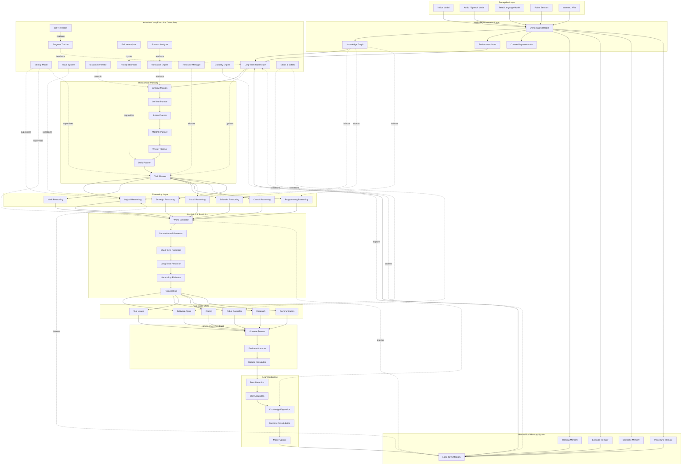

Yes. If your goal is to propose a **new AI architecture**, it should be written like an actual arXiv paper. Below is a research-paper style draft that you could later expand with mathematics, experiments, and algorithms.

---

# AmbitionNet: An Ambition-Centric Cognitive Architecture for Long-Horizon Artificial General Intelligence

**Author**

**Gobal Krishnan V**

Electronics and Communication Engineer

Email: [gobalkrishnan.work@gmail.com](mailto:gobalkrishnan.work@gmail.com)

Version 0.1 (Concept Paper)

---

## Abstract

Current Large Language Models (LLMs) excel at reasoning over individual prompts but lack persistent long-term objectives. They optimize for immediate responses rather than maintaining lifelong ambitions, evolving goals, or continuously improving toward a coherent future objective.

We introduce **AmbitionNet**, a cognitive architecture that extends existing reasoning models by introducing a persistent **Ambition Layer**, responsible for identity preservation, hierarchical goal generation, resource allocation, long-term planning, self-reflection, and continuous learning.

Unlike traditional reasoning systems that optimize the next token, AmbitionNet continuously optimizes future trajectories over months, years, or decades.

The architecture integrates perception, memory, reasoning, planning, prediction, and execution into a unified framework capable of long-term autonomous development.

---

# 1 Introduction

Modern AI systems have dramatically improved in:

* reasoning
* mathematics
* programming
* scientific discovery
* robotics

However, today's systems remain fundamentally reactive.

They answer:

> "What should I do now?"

They rarely ask:

> "What should I become?"

Human intelligence differs because people maintain ambitions over decades.

Examples include

* becoming a scientist
* building a company
* exploring space
* discovering new physics
* curing diseases

Such ambitions continuously influence every decision.

Current LLMs generally lack this persistent optimization process.

---

# 2 Problem Statement

Today's AI performs

```
Input

↓

Reason

↓

Output
```

Missing components include

* identity
* purpose
* long-term memory optimization
* lifetime planning
* persistent motivation
* goal evolution

As a consequence,

Reasoning ≠ Ambition

---

# 3 Ambition Hypothesis

We propose

> Intelligence alone is insufficient for AGI.

Instead,

```
AGI

=

Perception

+

Memory

+

Reasoning

+

Ambition

+

Learning

+

Execution
```

where

Ambition continuously optimizes future states rather than current outputs.

---

# 4 Proposed Architecture

```
Human

↓

Perception

↓

Knowledge Representation

↓

Memory

↓

Ambition Layer

↓

Hierarchical Planner

↓

Reasoning

↓

Prediction

↓

Learning

↓

Execution

↓

Environment

↓

Feedback

↓

Memory Update
```

---

# 5 Ambition Layer

Unlike transformer attention, the Ambition Layer operates across extremely long temporal horizons.

It contains

* Identity Model
* Value System
* Goal Generator
* Mission Planner
* Curiosity Engine
* Motivation Engine
* Priority Optimizer
* Resource Allocator
* Ethics Constraints
* Failure Analyzer
* Progress Tracker
* Opportunity Detector

Rather than predicting words,

it predicts

future objectives.

---

# 6 Hierarchical Planning

The planner decomposes

```
Life Mission

↓

10-Year Goal

↓

5-Year Goal

↓

1-Year Goal

↓

Monthly Goal

↓

Weekly Goal

↓

Daily Goal

↓

Current Task
```

Every task is evaluated by

```
Contribution(Task)

=

Impact on Future Goal
```

instead of

```
Probability(Next Token)
```

---

# 7 Memory Architecture

AmbitionNet introduces persistent memory.

```
Working Memory

↓

Episodic Memory

↓

Semantic Memory

↓

Procedural Memory

↓

Lifetime Memory
```

Unlike current LLM context windows,

Lifetime Memory continuously evolves.

---

# 8 Prediction Engine

Instead of producing one answer,

AmbitionNet generates many possible futures.

```
Present

↓

Simulation

↓

Future A

Future B

Future C

...

Future N
```

Each future receives

* probability
* risk
* cost
* expected reward
* uncertainty

---

# 9 Self-Reflection

The system periodically asks

```
Am I progressing?

Have priorities changed?

Did I fail?

Why?

What should I improve?

What knowledge is missing?

Should my ambition change?
```

This forms a closed-loop improvement cycle.

---

# 10 Mathematical Objective

Traditional language models optimize

```
maximize

P(next token)
```

AmbitionNet instead optimizes

```
maximize

Expected Lifetime Utility
```

where

```
Lifetime Utility

=

Knowledge

+

Skills

+

Goal Completion

+

Human Benefit

−

Risk

−

Resource Waste
```

---

# 11 Difference from Current LLMs

| Traditional LLM        | AmbitionNet                |
| ---------------------- | -------------------------- |
| Predict next token     | Predict future trajectory  |
| Short context          | Lifetime memory            |
| Single conversation    | Continuous identity        |
| Reactive               | Proactive                  |
| Prompt driven          | Mission driven             |
| Static objective       | Dynamic evolving objective |
| No persistent ambition | Persistent ambition        |

---

# 12 Potential Applications

* Scientific discovery
* Space exploration
* Robotics
* Autonomous laboratories
* Long-term education
* Healthcare planning
* Climate engineering
* Startup management
* Personal lifelong tutor
* AGI research

---

# 13 Challenges

Major research challenges include

* catastrophic forgetting
* scalable memory
* safe autonomous objectives
* value alignment
* ambition drift
* computational cost
* verification
* long-term planning uncertainty

---

# 14 Future Work

Future work includes

* differentiable ambition optimization
* hierarchical reinforcement learning
* memory compression
* world simulation
* self-generated curriculum
* autonomous scientific research
* embodied robotics
* multi-agent ambition systems

---

# 15 Conclusion

We argue that reasoning alone is insufficient for Artificial General Intelligence.

Long-term autonomous intelligence requires a persistent optimization process over years rather than milliseconds.

We therefore propose **AmbitionNet**, a cognitive architecture centered around an Ambition Layer that maintains identity, purpose, planning, learning, and continual self-improvement.

This work is intended as a conceptual foundation for future research into long-horizon autonomous AI systems.

---

## Keywords

Artificial General Intelligence (AGI), Long-Term Planning, Cognitive Architecture, Persistent Memory, Goal Optimization, Autonomous Agents, World Models, Reinforcement Learning, Lifelong Learning, AmbitionNet.

---

I think this could become a genuine research direction if you develop it further with:

1. a formal mathematical definition of the **Ambition Objective Function**,
2. algorithms for **goal generation and goal updating**,
3. a neural architecture integrating the Ambition Layer with transformers,
4. experiments comparing standard reasoning models against AmbitionNet on long-horizon tasks, and
5. safety and alignment mechanisms for persistent autonomous objectives.

Those additions would move it from a conceptual position paper toward a research paper suitable for submission to venues such as arXiv.

---

Yes. If you want this to look like an **arXiv research architecture**, it should not be just a flowchart. It should resemble a cognitive architecture (like ACT-R, Soar, OpenCog, or robotics architectures), with clearly separated modules, bidirectional data flow, and feedback loops.

I would structure it like this.



---

## Why this architecture is stronger than the previous one

It introduces several architectural concepts commonly discussed in AI and cognitive systems research:

* **Separation of concerns:** Perception, memory, reasoning, planning, learning, and execution are distinct modules.
* **Executive control:** The **Ambition Core** is not just another processing step; it acts as a persistent controller that influences planning, reasoning, learning, and execution.
* **Hierarchical planning:** Goals are decomposed from a lifetime mission down to individual tasks.
* **World simulation:** A dedicated module evaluates possible futures before actions are taken.
* **Closed-loop learning:** Execution outcomes feed back into memory and model updates for continual improvement.
* **Bidirectional interactions:** Memory, knowledge, and ambition continuously influence one another rather than following a one-way pipeline.

From a research perspective, this is closer to a **cognitive architecture** than a transformer diagram. To make it suitable for an arXiv paper, the next steps would be to define:

1. the mathematical objective optimized by the Ambition Core,
2. algorithms for updating long-term goals and priorities,
3. interfaces between the Ambition Core and reasoning modules, and
4. evaluation benchmarks demonstrating improved performance on long-horizon tasks compared with reasoning-only systems.

----

# We hypothesize that current reasoning-centric architectures lack persistent long-horizon objective formation.

---

