```mermaid
flowchart TD

%% ============================================================
%% CIVILIZATION ENGINEERING OPERATING SYSTEM
%% ============================================================


%% ============================================================
%% LEVEL 0 : HUMAN GOVERNANCE & PURPOSE
%% ============================================================

subgraph L0["LEVEL 0 : Human Civilization Governance"]

H1[Human Vision]

H2[Customer Need]

H3[Social Problem]

H4[Scientific Question]

H5[Innovation Goal]

H6[Future Civilization Goal]

H1 --> H2
H2 --> H3
H3 --> H4
H4 --> H5
H5 --> H6

end



%% ============================================================
%% LEVEL 1 : RESOURCE FOUNDATION
%% ============================================================

subgraph L1["LEVEL 1 : Resource & Reality Foundation"]

R1[Funding Intelligence AI]

R2[Investment Planning]

R3[Energy Availability]

R4[Material Availability]

R5[Supply Chain Intelligence]

R6[Manufacturing Capability]

R7[Human Expertise Mapping]

R8[Cost Optimization]

R9[Sustainability Analysis]


R1 --> R2
R2 --> R8

R3 --> R8
R4 --> R8
R5 --> R8
R6 --> R8
R7 --> R8

R8 --> R9

end


L0 --> L1



%% ============================================================
%% LEVEL 2 : KNOWLEDGE INTELLIGENCE
%% ============================================================

subgraph L2["LEVEL 2 : Global Knowledge Intelligence"]

K1[Research AI]

K2[Scientific Paper Search]

K3[Patent Intelligence]

K4[Standards Database]

K5[Open Source Intelligence]

K6[Industrial Knowledge]

K7[Historical Failure Database]

K8[Experiment Database]


KG[Knowledge Graph]

KM[Scientific Memory]


K1 --> K2
K1 --> K3
K1 --> K4
K1 --> K5
K1 --> K6
K1 --> K7
K1 --> K8


K2 --> KG
K3 --> KG
K4 --> KG
K5 --> KG
K6 --> KG
K7 --> KG
K8 --> KG


KG --> KM

end


L1 --> L2



%% ============================================================
%% LEVEL 3 : SCIENCE VALIDATION
%% ============================================================

subgraph L3["LEVEL 3 : Scientific Truth Validation"]

SV1[Source Verification]

SV2[Research Review AI]

SV3[Mathematical Validation]

SV4[Physics Validation]

SV5[Simulation Validation]

SV6[Experiment Validation]

SV7[Peer Expert Review]

SV8[Approved Scientific Knowledge]


SV1 --> SV2
SV2 --> SV3
SV3 --> SV4
SV4 --> SV5
SV5 --> SV6
SV6 --> SV7
SV7 --> SV8

end


L2 --> L3



%% ============================================================
%% LEVEL 4 : WISDOM SAFETY GOVERNANCE
%% ============================================================

subgraph L4["LEVEL 4 : Safety, Ethics & Life Protection"]

S1[Risk Analysis AI]

S2[Human Safety AI]

S3[Robot Safety AI]

S4[Environmental Impact AI]

S5[Multi Species Impact AI]

S6[Long Term Civilization Impact]

S7[Ethical Decision Engine]

S8[Approval Authority]


S1 --> S7
S2 --> S7
S3 --> S7
S4 --> S7
S5 --> S7
S6 --> S7

S7 --> S8

end


L3 --> L4



%% ============================================================
%% LEVEL 5 : AUTONOMOUS DESIGN ENGINE
%% ============================================================

subgraph L5["LEVEL 5 : Autonomous Design Intelligence"]


AD1[Requirement Understanding AI]

AD2[Generative Design AI]

AD3[Architecture Synthesis AI]

AD4[CAD Design AI]

AD5[Software Design AI]

AD6[Hardware Design AI]

AD7[Mechanical Design AI]

AD8[Optics Electronics Design AI]


AD9[Physics Constraint Solver]

AD10[Multi Objective Optimization]

AD11[Failure Prediction AI]

AD12[Design Ranking System]


AD1 --> AD2

AD2 --> AD3

AD3 --> AD4
AD3 --> AD5
AD3 --> AD6
AD3 --> AD7
AD3 --> AD8


AD4 --> AD9
AD5 --> AD9
AD6 --> AD9
AD7 --> AD9
AD8 --> AD9


AD9 --> AD10
AD10 --> AD11
AD11 --> AD12


end


L4 --> L5



%% ============================================================
%% LEVEL 6 : ENGINEERING ARCHITECTURE
%% ============================================================

subgraph L6["LEVEL 6 : Engineering System Architecture"]


E1[Requirement Engineering]

E2[System Architecture]

E3[Module Decomposition]

E4[Layer Architecture]

E5[Design Pattern Selection]

E6[Data Architecture]

E7[API Architecture]

E8[Security Architecture]

E9[Performance Architecture]

E10[Scalability Architecture]

E11[Configuration Management]

E12[Version Architecture]


E1 --> E2
E2 --> E3
E3 --> E4
E4 --> E5
E5 --> E6
E6 --> E7
E7 --> E8
E8 --> E9
E9 --> E10
E10 --> E11
E11 --> E12


end


L5 --> L6



%% ============================================================
%% LEVEL 7 : DIGITAL TWIN
%% ============================================================

subgraph L7["LEVEL 7 : Digital Twin & Simulation Reality"]

DT1[Virtual World Model]

DT2[Physics Simulation]

DT3[CAD Simulation]

DT4[Robot Simulation]

DT5[Human Simulation]

DT6[Environment Simulation]

DT7[Failure Simulation]

DT8[Optimization Simulation]


DT1 --> DT2
DT2 --> DT3
DT3 --> DT4
DT4 --> DT5
DT5 --> DT6
DT6 --> DT7
DT7 --> DT8


end


L6 --> L7



%% ============================================================
%% LEVEL 8 : VALIDATION ENGINE
%% ============================================================

subgraph L8["LEVEL 8 : Engineering Verification"]

V1[Requirement Verification]

V2[Architecture Verification]

V3[Design Verification]

V4[Code Verification]

V5[Hardware Verification]

V6[Integration Testing]

V7[Performance Testing]

V8[Security Testing]

V9[Human Approval]


V1 --> V2
V2 --> V3
V3 --> V4
V4 --> V5
V5 --> V6
V6 --> V7
V7 --> V8
V8 --> V9

end


L7 --> L8



%% ============================================================
%% LEVEL 9 : WORKFORCE ORCHESTRATION
%% ============================================================

subgraph L9["LEVEL 9 : Human AI Robot Workforce"]

W1[Project Manager AI]

W2[Architect AI]

W3[Developer AI]

W4[Test AI]

W5[Security AI]

W6[Documentation AI]

W7[Human Engineers]

W8[Humanoid Robots]

W9[Industrial Robots]

W10[Laboratory Systems]


W1 --> W2
W2 --> W3
W3 --> W4
W4 --> W5
W5 --> W6


end


L8 --> L9



%% ============================================================
%% LEVEL 10 : COMPUTER OPERATING LAYER
%% ============================================================

subgraph L10["LEVEL 10 : Computer Interaction Layer"]

C1[Vision Model]

C2[Audio Model]

C3[Browser Agent]

C4[Desktop Agent]

C5[Terminal Agent]

C6[IDE Agent]

C7[Git Agent]

C8[Build Agent]

C9[Test Runner]

C10[Simulation Agent]


W3 --> C1
W3 --> C2
W3 --> C3
W3 --> C4
W3 --> C5
W3 --> C6
W3 --> C7
W3 --> C8
W4 --> C9
W2 --> C10

end



%% ============================================================
%% LEVEL 11 : REAL WORLD EXECUTION
%% ============================================================

subgraph L11["LEVEL 11 : Physical Execution"]

P1[Manufacturing]

P2[Robotics]

P3[Laboratory Experiment]

P4[Field Deployment]

P5[Human Operation]


W8 --> P2
W9 --> P1
W10 --> P3

end



%% ============================================================
%% LEVEL 12 : FEEDBACK MEMORY EVOLUTION
%% ============================================================

subgraph L12["LEVEL 12 : Feedback Learning Evolution"]


F1[Sensor Data]

F2[Test Results]

F3[Performance Metrics]

F4[Failure Analysis]

F5[Knowledge Update]

F6[Engineering Memory]

F7[Architecture Improvement]

F8[New Version]


F1 --> F2
F2 --> F3
F3 --> F4
F4 --> F5
F5 --> F6
F6 --> F7
F7 --> F8


end


L11 --> L12


L12 --> L2
L12 --> L6
L12 --> L5



%% ============================================================
%% CORE MICROKERNEL
%% ============================================================

subgraph CORE["Recursive Engineering Microkernel"]

M1[Core Engine]

M2[Service Layer]

M3[Plugin System]

M4[Validation Framework]

M5[Memory System]

M6[Version Control]

M7[Knowledge Evolution]


M1 --> M2
M2 --> M3
M3 --> M4
M4 --> M5
M5 --> M6
M6 --> M7

end


CORE --> L5
CORE --> L6
CORE --> L12
```

I will combine all your previous architecture versions into one **deep + broad architecture**.

I understand the final system as:

**Civilization Engineering Operating System (CEOS)**

Purpose:

> Convert human vision into scientifically validated, resource-aware, safe, autonomous engineering solutions that can be designed, simulated, built, operated, learned from, and continuously evolved.

The architecture has **horizontal breadth** (domains) and **vertical depth** (layers).

---

---

## Final architecture characteristics

This version includes:

✅ Human purpose
✅ Funding/resource reality
✅ Research intelligence
✅ Scientific validation
✅ Safety + multi-species consideration
✅ Autonomous design
✅ Software + hardware + mechanical engineering
✅ CAD/CAE/simulation
✅ Digital twin
✅ AI engineering teams
✅ Human engineers
✅ Robots
✅ Computer agents
✅ Manufacturing
✅ Feedback learning
✅ Version evolution
✅ Recursive microkernel

The architecture is now closer to a **future autonomous engineering organization**, not only an AI coding system.

The remaining step after this would be designing the **internal microkernel architecture** (services, plugins, message bus, memory, agent communication, permissions, and data models).
